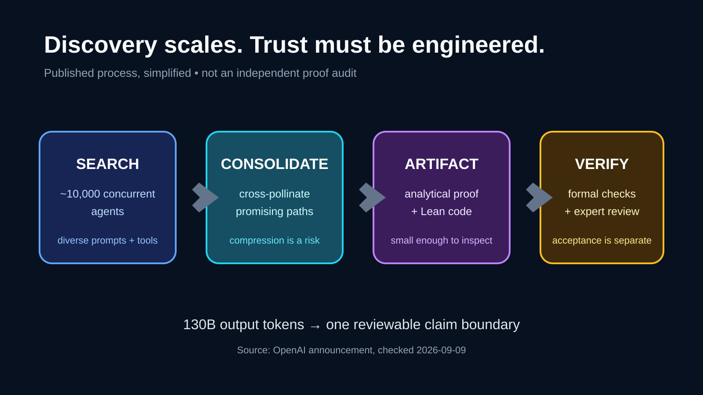
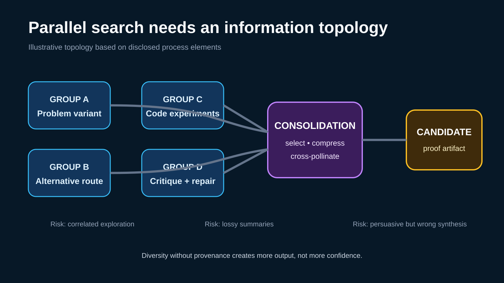
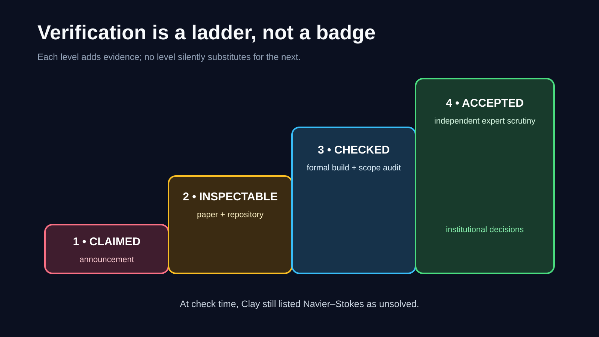
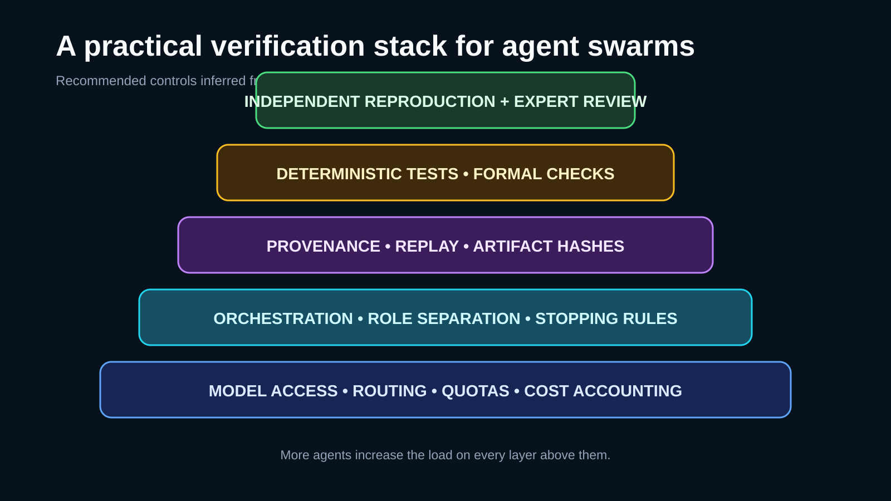

# 一万个 AI Agent 没有消灭科研瓶颈，而是把瓶颈转移到了验证

[English](English%20Article.md) | **中文**

> 最后核查：2026-09-09。OpenAI 发布了一篇 166 页论文和 Lean 代码，并称其解决了带外力 Navier–Stokes 问题的 C、D 两种情形。本文讨论的是这项声明及其工程意义，不把公司公告、公开仓库或形式化代码本身等同于数学共同体认可或 Clay 奖项认定。核查时，Clay 数学研究所仍将 Navier–Stokes 列在“未解决问题”中。

最值得关注的数字不是一万个 Agent，而是 **17 小时**。

OpenAI 称，约一万个并发 Agent 用约 88 小时找到了 Navier–Stokes 千禧年难题的候选解；相关过程产生 270 万条消息和约 1300 亿个输出 token。随后，GPT-6 Astra 又用了 17 小时完成 Lean 形式化与验证。

表面的故事是“扩大 Agent 数量，攻克百年难题”。对开发者更重要的故事是：当搜索规模膨胀到数百万条消息后，真正的产品不再只是生成答案，而是验证答案。

*原创解释图，依据 OpenAI 公布的流程绘制，用于区分生成、汇总、论文和形式化检查；它不构成对证明的独立验证。*

## 传播价值评分：94/100

| 维度 | 分数 | 理由 |
| --- | ---: | --- |
| 趋势相关性 | 10/10 | 多 Agent 正从演示进入真实科研流程。 |
| 开发工作流影响 | 9/10 | 其结构接近大规模软件搜索、评审与 CI。 |
| 时效性 | 10/10 | 论文、公告和 Lean 仓库均在 2026-09-08 发布。 |
| 讨论潜力 | 10/10 | 如果获认可，结果意义重大；但验证仍是开放过程。 |
| 机会价值 | 8/10 | 近期机会在验证基础设施，而不是照抄一份万人 Agent 账单。 |

**核心论点：** AI 辅助科学的未来不是更大的聊天机器人，而是把海量并行猜想压缩成少量、可独立检查产物的系统。

**反常识洞察：** 常见看法认为更多 Agent 主要意味着更强智能；更深层的变化是，更多 Agent 同时放大了来源追踪、结果汇总、可复现和对抗检查的需求。如果这种架构可以泛化，验证能力而非生成能力会成为稀缺资源。

## OpenAI 究竟发布了什么

OpenAI 9 月 8 日的公告包含四类不同主张，不能混为一谈：

1. 内部系统产出了一份三维不可压缩 Navier–Stokes 方程在光滑外力下有限时间爆破的解析证明。
2. 该构造从静止流体开始，动能始终有界，但速度在有限时间内趋于无界。
3. 结果对应 Clay 官方问题描述中的 C、D 两种情形，分别涉及全空间和周期环面。
4. OpenAI 同时发布论文与 Lean 4 形式化代码，并提供构建证书和独立检查的说明。

过程和结论同样重要。OpenAI 称，它把 Agent 分成可组内通信的多个群组，让不同群组处理不同问题变体、探索多种路线，把资源迁移到更有希望的方向，并用 Codex 汇总中间成果。产生 Navier–Stokes 结果的群组规模约为一万个并发 Agent。

*原创架构图。群组数量和拓扑是示意性的，流程标签来自 OpenAI 的公开描述。*

官方披露的规模非常惊人：所有尝试合计 490 万条消息和约 3000 亿输出 token；仅 Navier–Stokes 就有 270 万条消息和约 1300 亿输出 token。这些是厂商披露的数据，不是经过独立审计的效率基准。

## 发布证明，不等于证明已被接受

至少要区分四种状态：

| 状态 | 证据 | 尚不能证明什么 |
| --- | --- | --- |
| 已声明 | OpenAI 公告 | 数学正确性 |
| 可检查 | 论文和源码仓库 | 已被独立复现 |
| 机器检查 | Lean 产物能按说明构建和检查 | 定义、假设及其与完整非形式化主张的对应关系完全充分 |
| 共同体认可 | 专家评审和持续检验 | 自动获得 Clay 认可或奖金 |

本文核查时，Clay 官网仍将 Navier–Stokes 归为未解决问题。OpenAI 也明确表示无意申领奖项。这不是无关紧要的注脚，而是“报道可能具有历史意义的成果”和“宣布历史已经完成”之间的边界。

*原创验证阶梯。形式化检查很强，但独立评审仍需检查定义、定理范围、假设，以及论文与代码之间的对应关系。*

## 隐藏架构：搜索、选择、压缩、验证

一万个 Agent 并不等于一个智力提升一万倍的大脑。它更像分布式搜索系统，至少有四个困难的工程问题。

### 1. 搜索多样性

只有当工作节点探索真正不同的路径，并行才有价值。OpenAI 称它对不同群组采用了不同的问题表述和路线。否则，并发只是花更多钱复制相关性错误。

### 2. 不确定状态下的选择

完整证明出现之前，系统就必须识别值得继续的碎片。这类似在测试覆盖不足时筛选候选补丁或实验结果。

### 3. 上下文压缩

数百万条消息不可能全部进入最终上下文。汇总过程决定哪些中间结论被保留。一次有损摘要可能丢掉关键引理，也可能留下一个很有说服力的错误。

### 4. 独立验证

最终产物必须在不信任生成过程的前提下仍然可检查。Lean 提供了确定性的验证边界，但评审者仍需确认形式化定理说的究竟是什么，以及它如何对应完整数学主张。

这正是 Agent 编程平台已经遇到的结构：生成扩张得比评审更快。区别在于，错误补丁可能让服务故障，错误证明则可能让整个研究方向绕远路。

## 对开发者意味着什么

这套架构可以直接映射到 Agent 软件工程：

- 把每个 Agent 输出视为提案，而不是事实；
- 保存从最终主张回溯到原始资料的完整链路；
- 用不同角色分别负责生成、质疑、复现和形式化检查；
- 把验证算力与发现算力分开预算；
- 在启动大规模集群前定义停止条件；
- 发布最小可独立检查产物，而不是最大聊天记录。

*原创工程图。图中控制措施是根据公开科研流程推导出的建议，不是对 OpenAI 内部实现的陈述。*

当规模足够大，模型访问本身也会成为运营问题：路由、配额、重试和用量统计可能反过来淹没研究逻辑。统一 API 层可以减少针对不同提供商的重复集成。[SupaNexus](https://supanexus.ai/en) 是开发者可以评估的选项之一，它用 OpenAI 兼容入口连接多个模型系列；但它不替代实验设计、证明检查、身份控制或科研治理。

## 三个候选论点，以及最强的一个

1. **算力论：** 科学进展将越来越多地通过数据中心规模的推理购买。这很醒目，却没有回答可靠性问题。
2. **组织论：** Agent 拓扑和信息流会比任何单个节点的智力更重要。这可以在不同任务上检验。
3. **验证论：** 当并行生成变得充裕，稀缺能力将是把大量输出转化成紧凑、可独立检查的结果。

第三个论点最强，因为它给出了可观察的工作流和市场预测：团队将把更高比例的工程投入到评估器、证明助手、来源存储、重放系统与独立复现中。

## 五个预测

1. **验证 token 会成为单独披露的指标。** 只看输出 token，无法知道有多少算力用于质疑、复现和形式化。
2. **Agent 科研会采用类似 CI 的门禁。** 候选成果在外部评审前需要测试、依赖锁定、确定性构建和产物哈希。
3. **形式化方法会更靠近主流 AI 工具。** 并非所有科学主张都能写进 Lean，但可形式化部分会越来越多地由证明助手锚定。
4. **独立复现会成为一等角色。** 团队会把发现 Agent 与负责证伪或复现的 Agent 分开。
5. **更小的系统会靠更好拓扑竞争。** 一个路由合理、评估器强的百 Agent 系统，可能胜过规模大几个数量级但协调混乱的集群。

## 现在应该怎么做

不要先问如何启动一万个 Agent。先做一个更小的实验：

1. 选择一个有确定性或可由专家检查的成功标准的任务。
2. 把生成、批评和验证拆成不同角色。
3. 记录重放所需的来源、工具调用、模型版本和产物哈希。
4. 衡量单位算力产生的有效候选，而不是消息总数。
5. 让独立评审者只依靠发布产物复现结果。

如果一个结果在小规模下都无法通过这条流水线，增加 Agent 数量通常只会制造更大的“验证债务”。

Navier–Stokes 这次发布最终可能被记作数学里程碑、AI 里程碑，或两者兼有。但它当前已经给出一个清晰的工程信号：当生成可以无限并行时，信任必须被做成一套架构。

**讨论问题：** 如果一万个 Agent 产生候选证明的速度已经超过科学共同体的评审速度，验证层应该由谁拥有，又该如何证明其独立性？

## 来源与图片说明

- [OpenAI：On the Navier–Stokes Millennium Prize Problem](https://openai.com/index/navier-stokes-solution/)——官方公告和流程数据，核查于 2026-09-09。
- [OpenAI：Finite Time Blowup for Navier–Stokes](https://cdn.openai.com/pdf/32d9f210-8b73-45e0-91bc-82a30aef8a9a/navier-stokes.pdf)——公开论文，核查于 2026-09-09。
- [OpenAI NavierStokesAndEuler 仓库](https://github.com/openai/NavierStokesAndEuler)——Lean 代码和构建说明，核查于 2026-09-09。
- [Clay Mathematics Institute：Millennium Prize Problems](https://www.claymath.org/millennium-problems/)——官方状态页和问题背景，核查于 2026-09-09。
- 四张配图均为依据公开流程制作的原创解释型 SVG；拓扑或控制项属于示意的地方均已标注。

## 更新记录

- **2026-09-09：** 创建 GitHub 中英双语首版，加入声明/认可边界与四张验证主题图。
