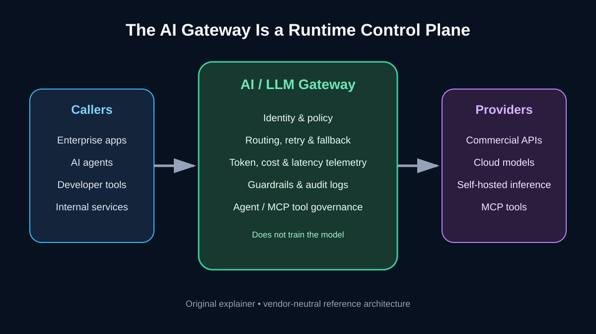
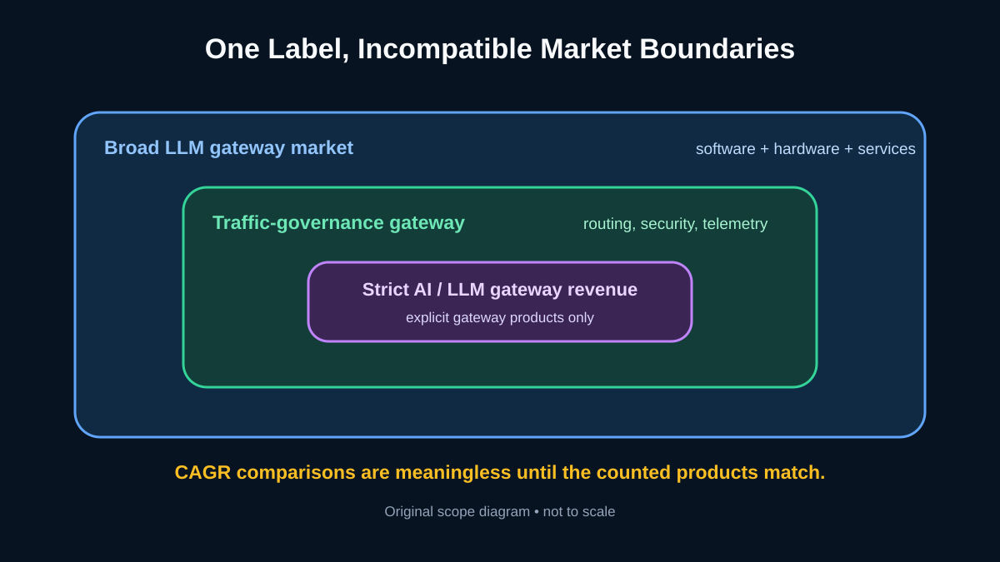
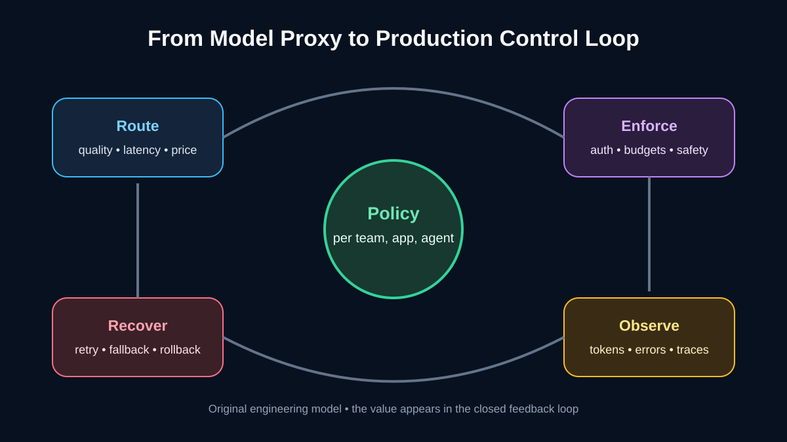
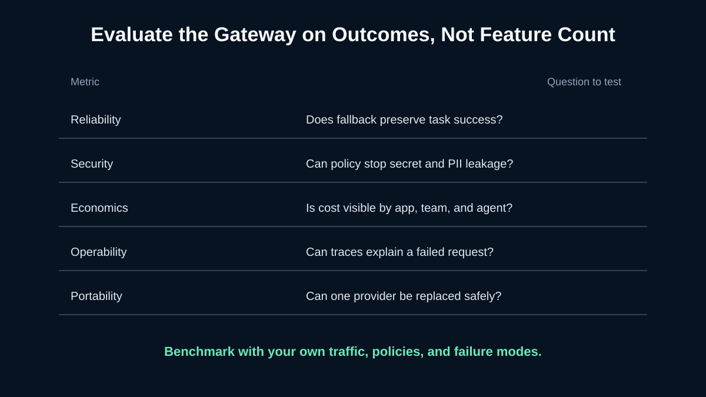

# The 2026 AI Gateway Market Reality: A High-Growth Consensus Built on Conflicting Definitions

[中文](2026%E5%B9%B4AI%E7%BD%91%E5%85%B3%E8%A1%8C%E4%B8%9A%E7%9C%9F%E7%9B%B8%EF%BC%9A%E9%AB%98%E5%A2%9E%E9%95%BF%E5%85%B1%E8%AF%86%E8%83%8C%E5%90%8E%E7%9A%84%E5%8F%A3%E5%BE%84%E6%88%98%E4%BA%89.md) | **English**

> Last checked: 2026-08-27. Market forecasts are not financial facts, and research firms draw the AI-gateway boundary differently. This article prioritizes official product documentation and regulator publications. Figures that could not be confirmed on a public first-party report page are labeled as estimates from a secondary summary.

The most suspicious thing about the AI gateway market is not slow growth. It is that the market can appear to be worth **$276 million, $2.76 billion, or much more at the same time**.

Those numbers do not necessarily contradict one another. One estimate may count only products explicitly sold as AI or LLM gateways. Another may count model-traffic governance software. A third may include hardware, consulting, integration, and managed services. Ranking them as competing forecasts is like comparing database license revenue with the entire data-infrastructure economy.

Remove that scope illusion and a more useful thesis appears: **the AI gateway is evolving from a model-request proxy into the runtime control plane for enterprise AI.** Whether one segment grows at exactly 45.1% is not what makes it important. Production permissions, spending, failures, and audits do.

*Original explainer. The capability groups are synthesized from official [Kong AI Gateway](https://developer.konghq.com/ai-gateway/) and [Cloudflare AI Gateway](https://developers.cloudflare.com/ai-gateway/) documentation; this is not a vendor deployment diagram.*

## What an AI gateway actually is

An AI gateway sits between enterprise applications, agents, developer tools, and model services. It does not train a model, and it is not synonymous with model hosting. Its job is to centralize cross-cutting concerns that otherwise spread across every application:

- normalize interfaces across model providers;
- centralize identities, credentials, permissions, and quotas;
- route by cost, latency, quality, or availability;
- execute retries, fallbacks, rate limits, and caching;
- record tokens, cost, latency, errors, and request traces;
- enforce policies on input, output, and agent/MCP tool calls.

This is not merely a conceptual checklist. Cloudflare's public documentation lists analytics, logging, caching, rate limiting, retries, and model fallback. Kong includes a universal interface, credential management, governance, observability, and connectivity for MCP and A2A. Product boundaries are still moving, but connectivity, governance, and observation already form a durable core.

## Three market estimates that should not be added or ranked

### The publicly verifiable broad estimate

The current public page for [The Business Research Company's 2026 report](https://www.thebusinessresearchcompany.com/report/large-language-model-gateways-market-report) includes software, hardware, and services. It estimates:

| Year | Estimated market size |
| --- | ---: |
| 2025 | $2.18 billion |
| 2026 | $2.76 billion |
| 2030 | $7.21 billion |

The page reports 26.9% growth from 2025 to 2026 and a 27.1% CAGR from 2026 through 2030. These figures do not match the circulating summary of $3.34 billion, $4.23 billion, and $11.01 billion. Reports are revised and boundaries can change, so this article uses the page publicly verifiable on August 27 rather than repeating an older summary.

### Narrow estimates that could not be verified on a public source page

The supplied QYResearch/CSDN summary contains two narrower estimates:

- “AI integration gateway / LLM AI Gateway”: RMB 129 million in 2025, RMB 1.749 billion in 2032, and a 45.1% CAGR for 2026–2032;
- “large-model traffic-governance AI gateway”: $310 million in 2025, $1.52 billion in 2032, and a 25.2% CAGR for 2026–2032.

As of the check date, we could not find a public QYResearch source page that confirms the definitions, currencies, base years, and methodology together. These figures are useful clues about narrow segmentation, but **they are not independently verified market facts** and should not be compared directly with a broad estimate that includes hardware and services.

*Original scope diagram, not drawn to monetary scale. It explains how strict product revenue, traffic-governance software, and a broad industry estimate can coexist.*

That is the report's most important reading rule: ask what was counted before looking at CAGR. A small, strict product segment growing at 45.1% can logically coexist with a broader and more mature market growing near 27%.

## The real growth engine: production magnifies every PoC shortcut

For one team testing one model, placing an API key in an environment variable may feel sufficient. Move to multiple models, teams, and agents in production, and that shortcut creates four kinds of debt:

1. **Identity debt:** Who is spending whose quota on which model?
2. **Reliability debt:** What happens when a provider throttles, times out, or retires a model?
3. **Cost debt:** An agent task may trigger dozens of model and tool calls. Which project owns the bill?
4. **Audit debt:** Where did sensitive data go, what actions occurred, and can the sequence be reconstructed?

The widely repeated “78% of enterprises use AI” claim also needs precise attribution. The Business Research Company page cites Typedef's retelling of McKinsey data: overall AI adoption rose from 55% a year earlier to 78%, while generative-AI use reached 67%. That is not AI-gateway adoption, nor is it an independent forecast for October 2025. It only supplies the demand context: enterprise AI use has broadened enough to make governance more urgent.

## Five player types are not competing for the same budget

The market can be divided by entry path, although the categories increasingly overlap:

| Entry path | Examples | Strongest starting point | Procurement question |
| --- | --- | --- | --- |
| API gateways | Kong, Tyk, Solo.io, API7 | Traffic engineering, plugins, private deployment | Are AI semantics, tokens, and tool calls first-class objects? |
| Cloud edge/developer platforms | Cloudflare, Vercel | Easy onboarding, global network, managed experience | What are the portability, data-boundary, and policy limits? |
| Specialist LLM gateways | Portkey, LiteLLM, others | Multi-model APIs, logs, budgets, rapid iteration | Are enterprise identity, audit, and HA mature? |
| Enterprise integration/data platforms | IBM, Apigee, MuleSoft, Databricks | Existing IT, data, and governance estates | Is the gateway a budget line or a bundled feature? |
| Unified model APIs | SupaNexus and others | Less duplicate provider integration | Are routing, credentials, and data policies transparent enough? |

This is more useful than a vendor ranking. A company already standardized on Kong, a team building on Cloudflare, and a developer who only needs one multi-model API face very different migration costs and buying centers.

## The hidden expansion: from model entry point to agent-tool firewall

An LLM request normally produces content. An agent tool call can read a database, modify a ticket, send a message, or execute code. As MCP and A2A spread, the control problem changes from “which model may be called?” to:

- Which tools may an agent discover?
- Which identity may call them, with what argument limits?
- Which actions require human approval?
- Can tool-returned data leave for an external model?
- How is the full cross-model, cross-tool trajectory retained?

Kong's current documentation already places LLM, MCP, and A2A connectivity in one governance story. That does not prove every gateway has mature agent governance today. It does show where the boundary is moving.

*Original engineering model. The gateway's value comes less from one proxy hop than from closing the routing, enforcement, observation, and recovery loop.*

## A gateway does not make a system compliant by itself

[NIST AI 600-1](https://www.nist.gov/publications/artificial-intelligence-risk-management-framework-generative-artificial-intelligence) is a cross-sectoral profile for managing generative-AI risk. It offers voluntary guidance around Govern, Map, Measure, and Manage. A gateway can supply identity, logging, enforcement, and evidence collection, but it cannot make risk decisions for the organization.

Likewise, EU AI Act obligations depend on a company's role, the system's risk category, its use, and the applicable timeline. A gateway is one technical component for data controls, records, and oversight—not a compliance certificate. Regulated organizations should put log retention, sensitive-data treatment, credential custody, and deployment geography into acceptance tests.

## Margins and opportunity: the most attractive number deserves the most restraint

The claim that AI gateway gross margins usually run 65%–85%, with pure SaaS reaching 75%–85%, sounds plausible but lacks a public, industry-wide sample. A gateway business may sell software subscriptions, metered model resale, hosted inference, networking, professional services, or hardware. Those mixes have radically different margins.

A defensible business analysis therefore separates subscription gross margin, model-cost pass-through, logging and network expense, enterprise support, and free-to-paid conversion. **High growth does not guarantee high profit, and a unified endpoint does not automatically create a moat.**

## What developers and enterprises should do now

Do not begin by buying the gateway with the longest feature list. Start with a four-week test using real traffic:

1. Select two model providers, one self-hosted endpoint, and one agent tool.
2. Define timeout, rate, budget, and sensitive-data policies.
3. Deliberately trigger 429s, timeouts, provider errors, and unsafe tool arguments.
4. Check whether fallback preserves task correctness—not merely an HTTP 200 response.
5. Reconcile tokens, spend, and audit trails by application, team, and agent.
6. Rehearse replacing one provider and measure code and data migration.

*Original evaluation framework. Benchmark with your traffic, policies, and failure modes rather than a vendor feature matrix.*

For teams already calling GPT, Claude, DeepSeek, and other models, a unified API layer such as [SupaNexus](https://supanexus.ai/) can reasonably reduce duplicate adapters and create a cleaner boundary for routing, replacement, and cost observation. It is one implementation path, not a substitute for enterprise identity, security review, or task-level evaluation. The failure and governance tests above should decide whether it fits.

## Four predictions for the next 12–24 months

### 1. “Number of supported models” will commoditize

OpenAI-compatible interfaces and provider adapters are increasingly easy to reproduce. Differentiation will move toward policy expressiveness, failure recovery, data boundaries, and explainable observability.

### 2. Agent and MCP governance will become the second growth curve

Model calls mainly introduce content and cost risk. Tool calls add real-world action risk. Identity propagation, fine-grained authorization, and human approval will become a new gateway control surface.

### 3. Gateways will be acquired or absorbed into larger platforms

API management, observability, security, cloud platforms, and LLMOps can all expand toward the same middle layer. Independent vendors must prove they are more than a thin proxy.

### 4. Research definitions will remain inconsistent

The product boundary has not stabilized, and bundled revenue is difficult to separate. Buyers should prioritize verifiable production outcomes over using one CAGR as a substitute for technical diligence.

## Conclusion

2026 may not be a provable “breakout year” with one precise market total. It may be the year enterprises start giving model traffic a formal control plane.

The real signal is not that one report prints 45.1%. It is that model calls are becoming production traffic, agent tools are becoming production permissions, and tokens are becoming accountable spend. When all three happen together, the gateway stops being a convenient API proxy.

Does your team need more model endpoints—or a control plane that still produces evidence when providers fail, agents overreach, and costs escape their budgets?

## Primary sources and image notes

- [The Business Research Company: Large Language Model Gateways Market Report 2026](https://www.thebusinessresearchcompany.com/report/large-language-model-gateways-market-report)
- [Kong AI Gateway documentation](https://developer.konghq.com/ai-gateway/)
- [Cloudflare AI Gateway documentation](https://developers.cloudflare.com/ai-gateway/)
- [NIST AI 600-1: Generative AI Profile](https://www.nist.gov/publications/artificial-intelligence-risk-management-framework-generative-artificial-intelligence)
- [European Commission: AI Act regulatory framework](https://digital-strategy.ec.europa.eu/en/policies/regulatory-framework-ai)
- The two QYResearch figures came from the supplied CSDN/QYRdata summary. They are not treated as verified facts because no publicly reviewable original report page was found.
- All four SVGs are original explainers, not report screenshots. The scope diagram is not drawn to monetary scale.

## Update log

- **2026-08-27:** First publication; corrected TBRC figures against the current public page, separated three market scopes, downgraded unverified QYResearch numbers, and added agent/MCP governance and production evaluation frameworks.
