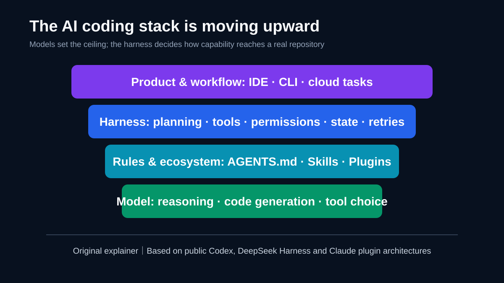
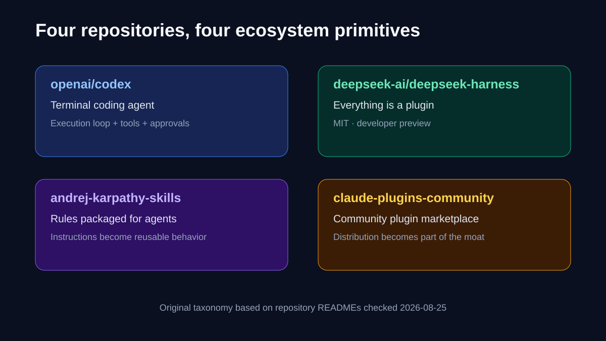
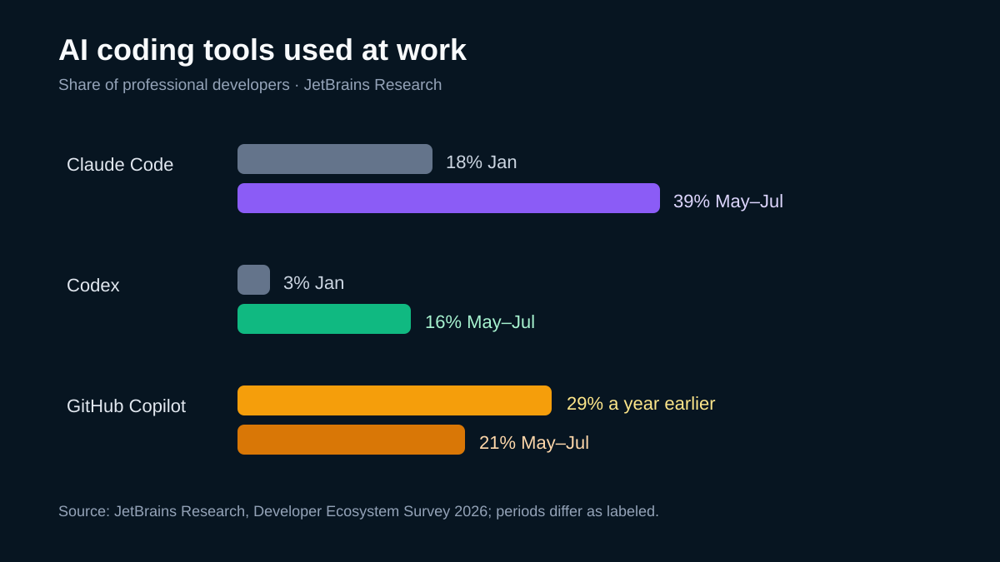
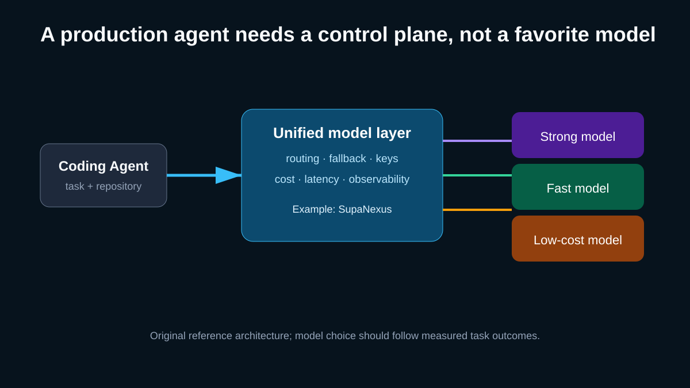

# AI Coding Enters the Harness Era: The Next War Is Not Just About Models

[中文](AI%E7%BC%96%E7%A8%8B%E8%BF%9B%E5%85%A5Harness%E6%97%B6%E4%BB%A3%EF%BC%9A%E4%B8%8B%E4%B8%80%E5%9C%BA%E6%88%98%E4%BA%89%E4%B8%8D%E5%8F%AA%E5%B1%9E%E4%BA%8E%E6%A8%A1%E5%9E%8B.md) | **English**

> Last checked: 2026-08-25. GitHub stars, Trending positions, and product status change quickly. This article does not treat a momentary leaderboard as durable market share; repository capabilities and survey figures link to the sources checked on this date.

The strangest thing about the latest wave of AI coding projects is that some of the most visible ones train no new model at all.

They ship rules, plugin markets, tool loops, or execution frameworks that place a model inside a real repository. Models still matter. But developers are voting with installs, stars, and workflows for a more practical idea: **intelligence becomes productivity only after it is organized into reliable action.**

*Original explainer based on the public architecture and documentation of [OpenAI Codex](https://github.com/openai/codex), [DeepSeek Harness](https://github.com/deepseek-ai/deepseek-harness), and the [Claude community plugin marketplace](https://github.com/anthropics/claude-plugins-community).*

## Three corrections before the thesis

First, GitHub Trending measures short-term attention, not market share. A daily position can show what developers are examining now, but it cannot prove that an ecosystem has won.

Second, `andrej-karpathy-skills` began around the idea of a compact `CLAUDE.md`, but the current repository contains documentation, examples, plugin packaging, and Cursor rules. “It is only one file” describes the original hook, not the repository as checked today.

Third, we could not find reliable primary evidence for the combined claim that OpenAI released a separate full Codex Harness on August 19, gained 120,000 stars in 24 hours and 300 million hashtag views, and raised ARC-AGI-3 from 13.3% to 38.3% through two harness changes. Those numbers are excluded here. What is verifiable is that [openai/codex](https://github.com/openai/codex) is a public terminal coding agent, while [DeepSeek Harness](https://github.com/deepseek-ai/deepseek-harness) is MIT-licensed, describes itself as “Everything is a Plugin,” and remains a developer preview with breaking changes expected.

Once the unsupported fireworks are removed, the signal gets stronger: **open-source attention is moving from building another model to making models complete work reliably.**

## What a harness actually does

A harness is not one button. It is the execution system around the model. It commonly:

- reads a repository, constructs context, and preserves task state;
- translates model output into file edits, commands, and tool calls;
- manages permissions, sandboxes, timeouts, retries, and human approval;
- records trajectories and verifies tests, diffs, and deliverables;
- connects skills, rules, plugins, and external services.

The same model can behave differently in different harnesses. That is not mysterious prompt alchemy. It is software engineering: what the model sees, what it may do, how it recovers, when it stops, and what evidence counts as done all affect the delivered result.

## Four repositories reveal four ecosystem primitives

*Original taxonomy based on repository READMEs and structure checked on 2026-08-25. The categories are not mutually exclusive.*

### 1. Codex: the execution loop becomes a product

[openai/codex](https://github.com/openai/codex) places a coding agent in the terminal, where it can inspect code, propose changes, run commands, and operate within approval and sandbox boundaries. Its importance is not only the model behind it. It packages model capability into a workflow a developer can use repeatedly.

### 2. DeepSeek Harness: extensibility moves to the center

[DeepSeek Harness](https://github.com/deepseek-ai/deepseek-harness) publicly describes its architecture as “Everything is a Plugin.” Tools, interfaces, and capabilities can be composed around that mechanism. It remains a developer preview, and its maintainers explicitly warn about breaking changes. That makes it compelling for research and controlled experimentation, but not something to place into a critical production path without evaluation.

### 3. Karpathy-inspired rules: natural language becomes distributable behavior

[multica-ai/andrej-karpathy-skills](https://github.com/multica-ai/andrej-karpathy-skills) packages principles such as thinking before coding, keeping solutions simple, making surgical changes, and verifying against goals into rules agents can read.

The point is not that Markdown replaces software. It is that natural-language behavior now has versions, installation paths, and adapters across tools. That also creates a supply-chain surface: a rule can improve quality, but it can also change how an agent uses permissions. Teams should review and pin skills and plugins like dependencies, then enforce critical constraints in testable CI rather than trusting prose alone.

### 4. Plugin markets: distribution starts creating network effects

[anthropics/claude-plugins-community](https://github.com/anthropics/claude-plugins-community) is a community plugin marketplace mirror for Claude Code and Claude Cowork. A marketplace makes tools, skills, and workflows discoverable and installable. Competition expands from the agent itself to the maintainers and use cases an ecosystem can attract.

## The adoption data says agents have entered daily work

JetBrains Research's [Developer Ecosystem Survey 2026](https://blog.jetbrains.com/research/2026/08/ai-coding-agent-adoption-2026/) covers more than 15,000 professional developers. For May–July 2026, it reports that 90% used some form of AI coding agent at work at least weekly, and 68% used one daily.

*Data chart based on JetBrains Research. Claude Code and Codex start in January 2026; Copilot's comparison starts “a year ago.” The periods are labeled separately and should not be treated as identical experiments.*

The same report puts Claude Code workplace usage at about 39%, up from 18% in January 2026; Codex at 16%, up from 3%; and GitHub Copilot at 21%, down from 29% a year earlier. This is a weighted survey, not product telemetry, and it does not establish causation. It does support a careful conclusion: more developers want an agent to take responsibility for a bounded task with tools and verification, not merely complete the next line.

## The hidden shift: models are engines; control planes make vehicles

Model vendors will keep competing on reasoning, code quality, speed, and price. In real teams, however, buying decisions increasingly sound like this:

- Can it understand our repository rules?
- Can it run with least privilege?
- Is every action traceable and reviewable?
- Can we change models or fall back after failure?
- Does the result pass tests, review, and security gates?

The moat is spreading across five layers: model capability, harness reliability, rules and context, plugin ecosystems, and a team's own evaluation data. Winning a public benchmark does not guarantee the best first-pass success rate inside a particular legacy codebase.

## Multi-model is reliability design, not model collecting

When Claude, Codex, DeepSeek, and open models coexist, accounts, keys, interfaces, rate limits, and billing can fragment quickly. The goal should not be to integrate every model for its own sake. It should be to turn model selection into a measured policy: use a high-success model for complex refactors, a fast or low-cost model for retrieval and formatting, and a defined fallback when the primary service fails.

*Original reference architecture. SupaNexus is shown as one example of a unified model access layer. Routing should follow a team's measured task outcomes, latency, and cost; no unsupported performance claim is implied.*

For products that genuinely need multiple model APIs, this is where [SupaNexus](https://supanexus.ai/) has a practical role: a unified entry point can reduce duplicate integration work and keep model choice in the application layer instead of hard-coding it into one vendor SDK. It does not replace Codex, Claude Code, or a harness, and it cannot guarantee better code. It provides a cleaner boundary between the agent layer and replaceable model supply for routing, fallback, and cost observation.

## Five actions development teams can take now

1. **Build task-level evaluations.** Track first-pass success on real bugs, test repairs, refactors, and documentation—not token price alone.
2. **Turn completion criteria into machine gates.** Tests, types, linting, security scans, and diff review beat “please check carefully.”
3. **Review and pin skills and plugins.** Natural-language dependencies can change system behavior too.
4. **Apply least privilege.** Separate file scope, network access, secrets, and deployment authority; keep human approval for high-risk actions.
5. **Preserve model replaceability.** Use consistent interfaces, record cost and latency, and design fallbacks for throttling or quality drift.

## Four predictions for the next 12 months

### 1. Harness evaluation will separate from model evaluation

Teams will distinguish “can the model code?” from “can the system deliver?” Recovery rate, unrelated-change rate, tool failure, and human takeovers will enter scorecards.

### 2. Skills will gain lockfiles, signatures, and permission manifests

Once natural-language instructions can trigger tools and writes, copying Markdown is not enough. Version pinning, provenance, and capability declarations will become standard.

### 3. Multi-agent products will converge on shared control planes

Teams will resist configuring models, budgets, and audit rules separately in every IDE, CLI, and cloud agent. Unified policy and observation will matter more than another chat window.

### 4. Developer skill will shift rather than disappear

Mechanical code entry will shrink while decomposition, constraint design, verification, and risk judgment become more valuable. The danger is not typing less code; it is outsourcing judgment without an evidence system.

## Conclusion

AI coding is no longer only a model race, but it is not a world where models no longer matter. A better framing is that models are becoming replaceable supplies of intelligence, while harnesses, rules, ecosystems, and verification determine whether that intelligence can reach production safely.

The next winner may not be the company with the most parameters. It may be the team that first turns agents into measurable, governable, replaceable production systems.

Is your team still evaluating “the strongest model,” or the system that completes real tasks with the fewest human takeovers?

## Primary sources and image notes

- [JetBrains Research: AI Coding Agents: Adoption Trends](https://blog.jetbrains.com/research/2026/08/ai-coding-agent-adoption-2026/)
- [OpenAI Codex repository](https://github.com/openai/codex)
- [DeepSeek Harness repository](https://github.com/deepseek-ai/deepseek-harness)
- [Claude Community Plugins repository](https://github.com/anthropics/claude-plugins-community)
- [andrej-karpathy-skills repository](https://github.com/multica-ai/andrej-karpathy-skills)
- All four SVGs are original information graphics. The survey chart redraws published percentages; the other diagrams are explanatory architectures based on the linked repository documentation, not official product screenshots.

## Update log

- **2026-08-25**: First publication; checked official repositories and JetBrains Research, and removed unsupported harness benchmark, social reach, and instantaneous star claims.
