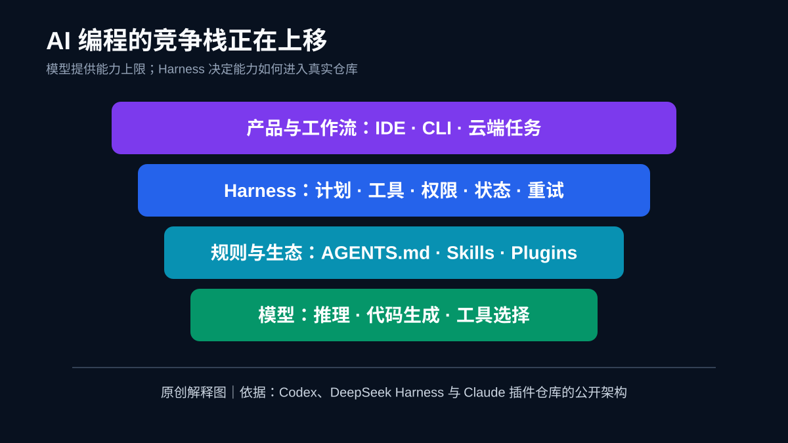

# AI 编程进入 Harness 时代：下一场战争不只属于模型

**中文** | [English](AI%20Coding%20Enters%20the%20Harness%20Era.md)

> 最后核查：2026-08-25。GitHub Star、Trending 排名和产品状态变化很快，本文不把某一时刻的榜单截图当成长期市场份额；仓库功能与调查数据均链接至核查时可访问的来源。

AI 编程最反常的一幕是：一些最受关注的项目，并没有训练新模型。

它们提供的是一套规则、一个插件市场、一条工具调用循环，或一个把模型放进真实仓库的执行框架。模型当然仍然重要，但开发者正在用 Star、安装和真实工作流投票：**“聪明”只有被组织成可靠行动，才会变成生产力。**

*原创解释图。结构依据 [OpenAI Codex](https://github.com/openai/codex)、[DeepSeek Harness](https://github.com/deepseek-ai/deepseek-harness) 与 [Claude 社区插件市场](https://github.com/anthropics/claude-plugins-community) 的公开说明整理。*

## 先纠正三个容易传播、却不够准确的说法

第一，GitHub Trending 是短周期热度榜，不是市场份额榜。当天排名与单日 Star 可以描述“此刻受到关注”，不能证明一个生态已经赢得长期竞争。

第二，`andrej-karpathy-skills` 的核心创意确实来自一份 `CLAUDE.md` 规则，但当前仓库已经包含 README、示例、插件与 Cursor 规则等内容。因此，“整个项目只有一个文件”适合作为它的起点描述，不是截至本文核查日的仓库事实。

第三，我们没有找到可靠一手来源支持“OpenAI 于 8 月 19 日完整开源独立 Codex Harness、24 小时 12 万 Star、话题阅读量 3 亿，以及两个 Harness 调整令 ARC-AGI-3 从 13.3% 升至 38.3%”这一整组说法。本文不采用这些数字。可确认的是，[openai/codex](https://github.com/openai/codex) 是公开的终端编码 Agent；[DeepSeek Harness](https://github.com/deepseek-ai/deepseek-harness) 明确以 MIT 许可开源，并称其架构为“一切皆插件”，目前仍是可能发生破坏性变化的开发者预览版。

把噪声拿掉后，趋势反而更清楚：**开源社区正在把注意力从“再造一个模型”，转向“如何让模型稳定完成工作”。**

## Harness 到底是什么

这里的 Harness 不是一个单独按钮，而是模型周围的执行系统。它通常负责：

- 读取仓库、构造上下文并保存任务状态；
- 把模型输出转换为文件编辑、命令执行和工具调用；
- 管理权限、沙箱、超时、重试和人工审批；
- 在长任务中记录轨迹，验证测试、差异和交付物；
- 接入 Skills、规则、插件与外部服务。

同一个模型放进不同 Harness，结果可能明显不同。这不是神秘的“提示词魔法”，而是软件工程：模型看到了什么、能做什么、何时停下、失败后如何恢复，以及什么证据才算完成，都会改变最终交付质量。

## 四类项目，拼出了 Agent 生态的四块基础设施

*原创分类图。依据四个仓库在 2026-08-25 的 README 与仓库结构制作，不表示它们功能互斥。*

### 1. Codex：执行循环本身成为产品

[openai/codex](https://github.com/openai/codex) 把编码 Agent 放进终端：读取代码、提出修改、运行命令，并通过审批与沙箱控制边界。它的重要性不只在于使用什么模型，而在于把模型能力包装成开发者可以连续使用的工作流。

### 2. DeepSeek Harness：把扩展性放在架构中心

[DeepSeek Harness](https://github.com/deepseek-ai/deepseek-harness) 的公开定位是“Everything is a Plugin”。这意味着工具、界面和能力可以围绕插件机制组合。它仍处于开发者预览阶段，官方明确提醒会发生兼容性破坏，因此更适合研究、试验和受控环境，而不是未经评估直接压上关键生产任务。

### 3. Karpathy-inspired rules：自然语言开始像代码一样分发

[multica-ai/andrej-karpathy-skills](https://github.com/multica-ai/andrej-karpathy-skills) 将“编码前思考、保持简单、只做必要修改、按目标验证”等原则包装为 Agent 可读取的规则。它真正有意思的地方，不是 Markdown 能替代软件，而是自然语言规则开始拥有版本、安装路径和跨工具适配。

这也带来新的供应链问题：一份规则可以提高质量，也可能改变 Agent 的权限使用与行为。团队应像审查依赖一样审查 Skills 和插件，固定版本，并把关键约束放进可测试的 CI，而不是只相信提示文字。

### 4. 插件市场：分发渠道开始形成网络效应

[anthropics/claude-plugins-community](https://github.com/anthropics/claude-plugins-community) 是 Claude Code 与 Claude Cowork 的社区插件市场镜像。插件市场将工具、Skills 和工作流变成可发现、可安装的产品，也让竞争从单个 Agent 扩展到谁能吸引更多维护者和使用场景。

## 调查数据说明：Agent 已经进入日常工作

JetBrains Research 的 [Developer Ecosystem Survey 2026](https://blog.jetbrains.com/research/2026/08/ai-coding-agent-adoption-2026/) 覆盖超过 15,000 名专业开发者。其 May–July 2026 数据显示，90% 的受访专业开发者在工作中至少每周使用一次某种 AI 编码 Agent，68% 每天使用。

*数据图。来源：JetBrains Research；Claude Code 与 Codex 的起点为 2026 年 1 月，Copilot 对比起点为“一年前”，图中按原文分别标注，不能当作完全相同周期的实验。*

同一报告显示：Claude Code 的工作使用率从 2026 年 1 月的 18% 升至 5–7 月的约 39%；Codex 从 3% 升至 16%；GitHub Copilot 从一年前的 29% 降至 21%。这是一项经加权的调查，不是产品遥测，也不能证明因果关系。但它足以支持一个谨慎判断：越来越多开发者要的不是补全下一行，而是让 Agent 接手一个有开始、有工具、有验证标准的任务。

## 隐藏的行业转移：模型是引擎，控制平面才是车辆

模型厂商仍会竞争推理、代码质量、速度和价格。然而在真实团队中，采购问题正变成：

- 它能否理解我们的仓库规范？
- 是否能在最小权限下运行？
- 每一步是否可追踪、可复盘？
- 失败时能否切换模型或回退？
- 最终结果是否通过测试、评审与安全门禁？

这意味着护城河会分散到五层：模型能力、Harness 可靠性、规则与上下文、插件生态，以及团队自身的验证数据。一个模型在公开基准上更强，不等于它在某个遗留仓库里拥有更高的一次成功率。

## 多模型不是“模型收藏”，而是可靠性设计

当 Claude、Codex、DeepSeek 与更多开源模型同时存在时，团队很容易陷入账户、密钥、接口、限流和账单碎片化。正确的目标不是把每个模型都接一遍，而是把选择变成可测量的策略：复杂重构交给成功率更高的模型，检索和格式化交给更快、更便宜的模型，主服务异常时有明确的降级路径。

*原创参考架构。图中的 SupaNexus 是统一模型接入层的一个示例；模型路由应基于团队自己的成功率、延迟和成本数据，本文不作未经验证的性能承诺。*

对需要多模型 API 的产品，[SupaNexus](https://supanexus.ai/) 的实际价值在这里才成立：用统一入口降低重复接入成本，并把模型选择留在应用层，而不是写死在某一家供应商的 SDK 里。它不替代 Codex、Claude Code 或 Harness，也不自动保证更好的代码；它更像模型层与 Agent 层之间的可替换接口，为路由、故障切换和成本观察提供更整齐的边界。

## 开发团队现在可以做的五件事

1. **建立任务级评测。** 用真实 Bug、测试修复、重构和文档任务记录一次成功率，而不是只比较 Token 单价。
2. **把完成条件写成机器可验证的门禁。** 测试、类型检查、lint、安全扫描与 diff 审查比“请认真检查”更可靠。
3. **审查并固定 Skills 与插件版本。** 自然语言依赖同样会改变系统行为。
4. **实行最小权限。** 将读写范围、网络访问、密钥和部署权拆开，给高风险操作保留人工确认。
5. **保留模型可替换性。** 统一接口、记录成本与延迟，并为限流或质量波动设计回退。

## 接下来 12 个月的四个预测

### 预测一：Harness 评测会独立于模型评测

团队会逐渐区分“模型会不会写代码”和“整套 Agent 能不能交付”。任务恢复率、无关修改率、工具失败率和人工接管次数将进入评测表。

### 预测二：Skills 会出现锁文件、签名与权限清单

当自然语言指令能够触发工具与文件写入时，只靠复制 Markdown 不够安全。版本固定、来源验证和能力声明会成为标准组件。

### 预测三：多 Agent 产品会收敛到统一控制平面

团队不会愿意在每个 IDE、CLI 和云端 Agent 中重复配置模型、预算与审计。统一策略和观测层会比“再加一个聊天窗口”更有价值。

### 预测四：开发者能力不会消失，但会重新分配

机械输入代码的占比会下降，问题拆解、约束设计、验证与风险判断会升值。真正危险的不是少敲代码，而是把判断也外包出去，却没有证据系统兜底。

## 结语

AI 编程已经不只是模型竞赛，也还没有简单到“模型不重要”。更准确的说法是：模型正在成为一层可替换的智能供给，而 Harness、规则、生态和验证决定这份智能能否安全抵达生产环境。

下一轮赢家，可能不是拥有最多模型参数的人，而是最先把 Agent 变成可度量、可治理、可替换生产系统的人。

你所在的团队，现在评估的是“哪个模型最强”，还是“哪套系统能用最少人工接管完成真实任务”？

## 主要来源与图片说明

- [JetBrains Research：AI Coding Agents: Adoption Trends](https://blog.jetbrains.com/research/2026/08/ai-coding-agent-adoption-2026/)
- [OpenAI Codex 官方仓库](https://github.com/openai/codex)
- [DeepSeek Harness 官方仓库](https://github.com/deepseek-ai/deepseek-harness)
- [Claude Community Plugins 官方仓库](https://github.com/anthropics/claude-plugins-community)
- [andrej-karpathy-skills 仓库](https://github.com/multica-ai/andrej-karpathy-skills)
- 四张 SVG 均为本文原创信息图；其中调查图复绘公开百分比，其余为基于上述仓库文档的解释性架构图，不是官方产品截图。

## 更新记录

- **2026-08-25**：首发；核验官方仓库与 JetBrains Research，移除无法由一手来源支持的 Harness 基准、社交阅读量与瞬时 Star 说法。
