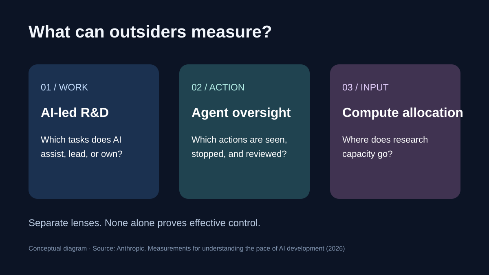
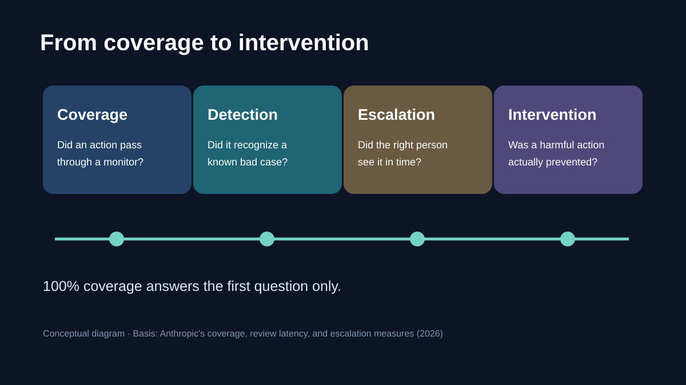
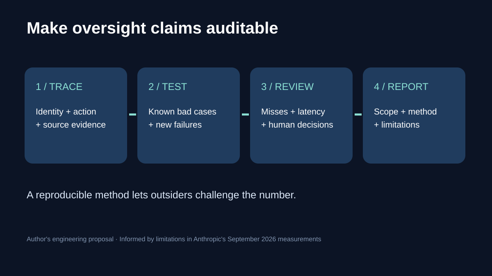

# AI Is Building AI: The Oversight Gap Behind Anthropic's New Measurements

[阅读中文版](中文文章.md)

An AI lab can count every agent action and still struggle to answer the question that matters: **would its monitors recognize the dangerous action?** Anthropic's new measurements make that gap visible. They describe how much of its own research Claude helps perform, how its internal agents are monitored, and where research compute goes. The figures are useful, but their real value is the reporting template they suggest for an industry that increasingly uses AI to build AI.

Anthropic published three measurement proposals on September 17, 2026, with snapshots from its own systems: an R&D automation index, agent oversight metrics, and compute allocation. These are **Anthropic-reported measurements**, not independently verified industry baselines. Anthropic says it plans to give outside evaluators access to internal processes and data; that future plan should not be confused with independent verification of every figure reported now. [Source](https://www.anthropic.com/institute/measuring-pace-of-ai-development)

*Figure 1. The three proposed lenses measure different parts of the development process. Diagram by the author, based on Anthropic's September 2026 methodology.*

## The number that needs a definition

Anthropic says Claude “leads” 26% of its measured AI R&D work as of August 2026, while more than 90% is at or above its “AI collaborates” level. It explicitly says Claude is **not fully autonomous in any measured subset**. “Leads” means a model can handle most of a task from a high-level prompt while a human supervises; it does not mean an unattended model designs, tests, and ships its successor. The levels come from an Epoch AI scale, applied by Anthropic to its own task map. [Source](https://www.anthropic.com/institute/measuring-pace-of-ai-development)

The index is more informative than an anecdote about a spectacular coding run, yet it is not a stopwatch reading of all research hours. Anthropic assembled about 15,000 granular tasks from sampled July work records, organized them into a fixed task tree, assigned automation levels, and weighted categories using a proxy for person-time. The judge was itself a Claude model. Anthropic reports 59% exact agreement between model and human ratings, versus 35% between humans, and 97% agreement within one level. Those figures show how debatable the category boundaries can be; they do not remove the need for external checks or a shared cross-lab method. A frozen task basket can also miss a shift toward new kinds of human work. [Source](https://www.anthropic.com/institute/measuring-pace-of-ai-development)

That distinction matters for developers outside frontier labs. “How many tasks use AI?” is a weak proxy for “which decisions can AI make without a person?” A useful inventory records the task, the permitted tools, the decision point, the required human sign-off, and the evidence retained. If a team cannot reconstruct one consequential agent run, its automation percentage is mostly a productivity statistic.

## Monitoring coverage is only the first question

Anthropic reports about 30,000 agents active at a time on its most-used internal research and engineering platform in August 2026. Its stated monitoring figures apply **to that platform**, not to every agent Anthropic runs. It says 100% of those agents' actions pass through an online monitor before execution and 100% are ingested by an offline monitor afterward. The online monitor blocked 0.002% of more than a billion decisions examined in August. The offline monitor flagged roughly one or two transcripts per thousand; about 50 high-priority flags per week reached human review. [Source](https://www.anthropic.com/institute/measuring-pace-of-ai-development)

These counts describe a monitoring pipeline, not a measured detection rate for all harmful behavior. Low blocking could mean agents behaved well, controls were effective, the monitor missed harmful actions, or some combination. Coverage answers whether an action passed through a monitor. It does not answer whether the monitor understood context, whether a reviewer saw the right evidence, or whether intervention arrived before harm.

*Figure 2. A complete logging path does not by itself establish detection quality. Conceptual diagram by the author; the categories follow Anthropic's coverage, review-latency, and escalation framework.*

Anthropic's own framework points to three separate measures: **coverage**, **review latency**, and **escalation rate**. Its online monitor checks before execution and humans review blocked actions within a week; offline monitoring looks after the fact and sends selected cases through classifiers and then human review. These timings serve different risks. A reversible error can be investigated later; an action that exposes sensitive material needs a reliable stop before execution. Anthropic also calls for reporting how often known agent misbehavior is caught and for independent tests of that capability. [Source](https://www.anthropic.com/institute/measuring-pace-of-ai-development)

For an engineering team, the practical design is to log actions under a persistent agent identity, link messages to source evidence, and distinguish *proposed*, *blocked*, *executed*, and *reviewed* actions. Anthropic describes persistent agent identities and shared, cross-referenced communication in its own scaffold. That architecture makes reconstruction possible, but teams still need to test whether monitors catch seeded failures and whether people can intervene in time.

## Compute is an input, not a safety score

Anthropic's third snapshot covers one week, July 13–20, 2026. It estimates that about 6% of compute assigned to AI R&D went to safety work, and about 12% of compute for AI-driven AI R&D went to safety. Anthropic calls these conservative estimates and acknowledges classification choices, best-effort workload labels, and the fact that a week cannot establish a trend. More efficient safety methods could also reduce compute share while improving outcomes. These percentages should therefore not be turned into a league table for “which lab is safest.” [Source](https://www.anthropic.com/institute/measuring-pace-of-ai-development)

The more useful question is whether a lab can define categories clearly enough for a third party to reproduce the calculation. Anthropic describes classifier-based labeling and proposes independent review of sampled jobs and transcripts. If categories vary across labs, similar percentages may mean very different things. If they are stable and auditable over time, compute allocation can help outsiders ask better questions about priorities.

*Figure 3. A proposed reporting loop for agent systems, derived from the limits Anthropic identifies. This is an engineering recommendation, not an Anthropic deployment claim.*

## What builders can do this week

Start with one high-impact agent workflow, not a company-wide dashboard. Map its allowed actions and mark the point where an external effect occurs. Record every attempted tool action with agent identity, task context, source reference, decision, timestamp, and reviewer outcome. Then run a small set of known bad cases against the monitor. Measure the share caught before execution and the time to human review. Report the cases the monitor missed as carefully as the cases it flagged. Repeating this on a fixed test set makes changes visible; rotating in new failures limits overfitting.

For teams that access several models, a unified API can simplify provider-specific integration. SupaNexus is one option with an OpenAI-compatible interface, one Base URL, and a project-scoped API key, according to its [approved product description](https://supanexus.ai/en). That integration layer does not establish agent oversight: action records, monitor tests, review paths, and task-level evaluation still need their own design.

Three developments are worth watching. First, automation percentages may become less meaningful without published task definitions and consistent weighting; Anthropic's own limitations show why. Second, “100% monitored” claims will invite independent detection tests, because passing through a monitor is easier to count than catching a harmful action. Third, reviewers will ask for evidence that joins an agent's identity, communications, tool actions, and human decisions into one trace. Each prediction can be tested against future public reports and outside evaluations.

The central question is simple: if a lab says its agents are monitored, what evidence would let an outsider distinguish comprehensive logging from effective oversight?

## Sources

- [Anthropic, “Measurements for understanding the pace of AI development inside frontier labs”](https://www.anthropic.com/institute/measuring-pace-of-ai-development), accessed September 18, 2026. Primary source for all Anthropic-reported figures and methodology.
- [SupaNexus English homepage](https://supanexus.ai/en), product description only.

## Update notes

- September 18, 2026: Initial draft. Figures are attributed to Anthropic and retain their stated scope and limitations. No independent verification of Anthropic's internal measurements is claimed.
