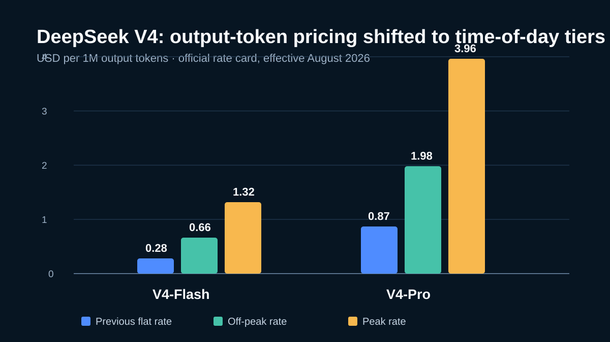
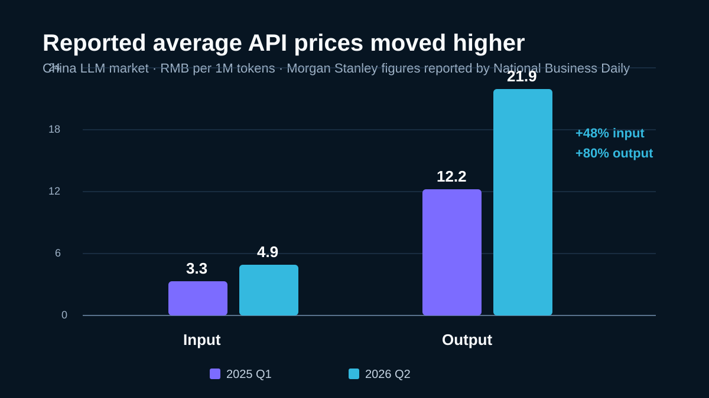
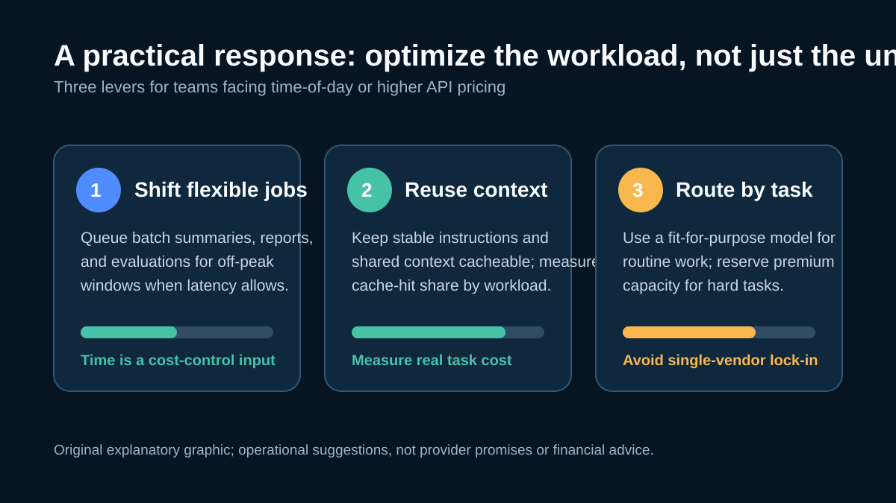

# 中国 AI 模型 API 市场正在重新定价：从价格战到工作负载价值

[English](China%20AI%20API%20Pricing%20Shift.md) | **中文**

> 最后核查：2026-08-22。API 价格、模型可用性和产品条款变化很快。本文数字仅作带日期的参考；生产接入与预算决策前，请核对实时价格页。

中国 AI 模型 API 市场并非正在经历一次整齐划一的“全面涨价”。更准确的说法是，头部厂商开始尝试更高的价格、按时段计费，以及对高算力工作负载更明确的分层。DeepSeek 在 8 月的价格调整，是最近最清晰的例子。

对开发者而言，真正的变化不只是单个 Token 变贵，而是“单价最低”越来越不能代表“完成一项工作最便宜”。

## DeepSeek 把时间写进了账单

DeepSeek 宣布为 V4-Pro 和 V4-Flash 引入峰谷定价，自北京时间 8 月 17 日 00:00 起生效。峰时为 09:00–12:00、14:00–18:00，其余时间采用更低的闲时价格。该公司表示，此举旨在更合理地调配资源，并鼓励用户按实际使用情况安排任务。实时价格应始终以 [DeepSeek 官方价格文档](https://api-docs.deepseek.com/quick_start/pricing/) 为准。

下图采用官方公布的输出 Token 价格。它说明了一个容易被忽略的事实：闲时价虽然是峰时价的一半，但两个新时段价格均高于此前的统一价格。

*原创图表：llm-cat 根据 DeepSeek 官方价格表制作。单位为美元/百万输出 Token；请在实际使用前核对实时文档。*

路透社报道指出，按模型、Token 类型和使用时段不同，新价格相较此前的变动范围约为 50% 至 1,100%。这一跨度很关键：智能体工作流中，缓存命中输入、未命中输入和输出 Token 的比例差异很大。[路透社报道](https://www.investing.com/news/economy-news/deepseek-raises-api-pricing-for-its-v4-models-4857662)

## 这是一种市场模式，不是所有厂商同步加价

不能因为一个事件，就得出“中国所有模型厂商、所有产品均已涨价”的结论。定价会因模型档位、促销、云渠道、地区，以及 API、消费者订阅和企业合同的不同而变化。

但近期公开报道的方向值得关注。每日经济新闻援引摩根士丹利统计称，在调查多家主要中国厂商的官方报价后，中国大模型 API 的平均输入价格从 2025 年第一季度的每百万 Token 3.3 元，升至 2026 年第二季度的 4.9 元；平均输出价格从 12.2 元升至 21.9 元。这是市场层面的估算，并不能代替任一厂商的实时报价，但可帮助理解行业激励的变化。

*原创图表：llm-cat 使用 [每日经济新闻](https://www.nbd.com.cn/articles/2026-08-13/4541068.html) 援引的摩根士丹利数据制作。这是市场估算，不是任何单一供应商的报价。*

也能看到选择性重新定价的迹象。例如，澎湃新闻与 21 世纪经济报道均描述了智谱围绕 GLM-5 发布的一系列价格调整；与此同时，部分厂商仍在降价、促销，或调整产品栈中的其他收费项目。更有用的结论不是“价格只会上涨”，而是：对高需求的前沿工作负载而言，长期、普遍补贴的低价越来越难以成立。

## 为什么单价正在承压

这轮变化背后有三股力量。

第一，推理是持续发生的运营成本。每次长上下文请求、工具调用和生成 Token 都要消耗资源。在抢占市场阶段，模型可以很便宜；但当使用量长期处于高位，这种价格未必能覆盖成本。

第二，需求的形态变了。普通对话通常边界清晰；编程 Agent、研究 Agent、文档流水线和自动分析任务会反复读取上下文、调用工具、生成中间结果，并持续重试。单个用户产生的总吞吐量，可能远高于常规聊天。

第三，价格正在成为容量管理工具。按时段计费能在不拒绝全部需求的前提下，把可延迟的任务引导到低负载窗口。这种逻辑在云基础设施里早已常见；它出现在模型 API 中，意味着推理算力本身正被当作稀缺的生产资源来管理。

## 开发者的影响：衡量完整工作流

不同团队受到的影响并不相同。对实时客服之类的低延迟场景，流量几乎没有时间弹性；对夜间评测、文档批处理、报表生成或后台索引任务，调度空间则更大。

更重要的是，账单取决于整个工作负载结构：

- 缓存命中与未命中输入的占比；
- 输出长度、推理与工具调用轨迹；
- 重试率和任务成功率；
- 峰时流量占比；
- 模型返回后仍需投入的人工审核与修复时间。

因此，“每百万 Token 的人民币/美元价格”是必要指标，却不是完整的决策规则。便宜模型如果需要更多重试，或带来更多修复工作，单个完成任务的成本可能更高；反过来，价格较高的模型若能用更少调用干净地完成难任务，也可能更经济。

## 可落地的成本应对方式

第一步应当是可观测性，而不是恐慌式迁移。按工作负载、供应商、模型、时段、缓存状态、Token 结构、延迟和成败结果记录请求；然后比较“完成一件工作的成本”，而不是只比价格页上的一个数字。

*原创说明图：llm-cat 制作。前两项直接对应时段定价与缓存敏感型价格表；路由是架构建议，不是对任一供应商能力或价格的承诺。*

1. **把可延迟任务转移至闲时。** 在满足时效的前提下，排队处理摘要、报告和评测等批任务；若供应商确有峰谷价差，这能直接降低成本。
2. **围绕缓存复用设计。** 在供应商规则允许时，保持稳定的系统提示、可复用项目上下文和重复工具 Schema 一致。必须测量实际效果，不能想当然地假设缓存行为。
3. **按任务而不是按品牌路由。** 以评测数据为依据，为常规抽取、长文本分析、复杂编程和面向用户的交互选择最适合的模型。
4. **加入预算护栏。** 在价格或额度变化演变成故障之前，设置单任务上限、异常告警、队列优先级和降级策略。

## 架构灵活性会成为商业优势

更深层的影响是供应商灵活性。把所有路径都直接写死在单一供应商上的团队，会暴露在价格修订、容量限制、额度变化和模型迭代的风险中。一个轻量的模型路由层，可以把提示词、可观测性、成本控制和故障切换策略与某一家 API 的接入逻辑分开。

这并不代表每个请求都应该在模型之间动态切换。稳定性、安全、数据处理规则和评测质量仍然重要。它代表的是：在真正紧急之前，就把测试、路由和替换的选择权设计进去。

对于不希望为每个模型供应商分别维护账户与接入逻辑的团队，可以考虑 [SupaNexus](https://supanexus.ai/) 这类统一的多模型 API Gateway。它的价值在于运营灵活性：针对明确的工作负载比较供应商，集中管理用量控制，并在价格或容量变化影响业务时保留可用的备选路径。

## 小结

DeepSeek 的调整并不代表价格竞争已经结束，但它确实说明，前沿模型厂商开始更明确地为算力、使用时段和工作负载强度定价。市场正在从“谁能标出最低 Token 单价”，走向“这类工作负载能以多大能力和可靠性，维持可持续的成本”。

开发者的应对重点应是：测量真实任务经济性，利用合理的调度与缓存机会，并让架构保留足够的灵活性，把模型选择变成基于证据的决策。

## 来源与图片说明

- [DeepSeek：模型与价格](https://api-docs.deepseek.com/quick_start/pricing/)——V4 价格表与模型条款的一手来源，访问日期：2026-08-22。
- [路透社：DeepSeek 上调 V4 API 价格](https://www.investing.com/news/economy-news/deepseek-raises-api-pricing-for-its-v4-models-4857662)——8 月调整范围的新闻报道，访问日期：2026-08-22。
- [每日经济新闻：市场定价报道](https://www.nbd.com.cn/articles/2026-08-13/4541068.html)——文中援引的摩根士丹利市场平均价格数据，访问日期：2026-08-22。
- [澎湃新闻：智谱价格调整](https://www.thepaper.cn/newsDetail_forward_32777991) 与 [21 世纪经济报道：智谱定价](https://m.21jingji.com/article/20260617/herald/cf85ded89035d5023752dc7d692669f6.html)——选择性重新定价的行业背景，访问日期：2026-08-22。
- `attachments/` 中三张 SVG 均为 llm-cat 原创数据图和说明图；未复制厂商图表，也不表示厂商背书。

*本文依据截至 2026-08-22 的公开文档与报道整理，不构成投资、法律、采购或技术选型建议。*
