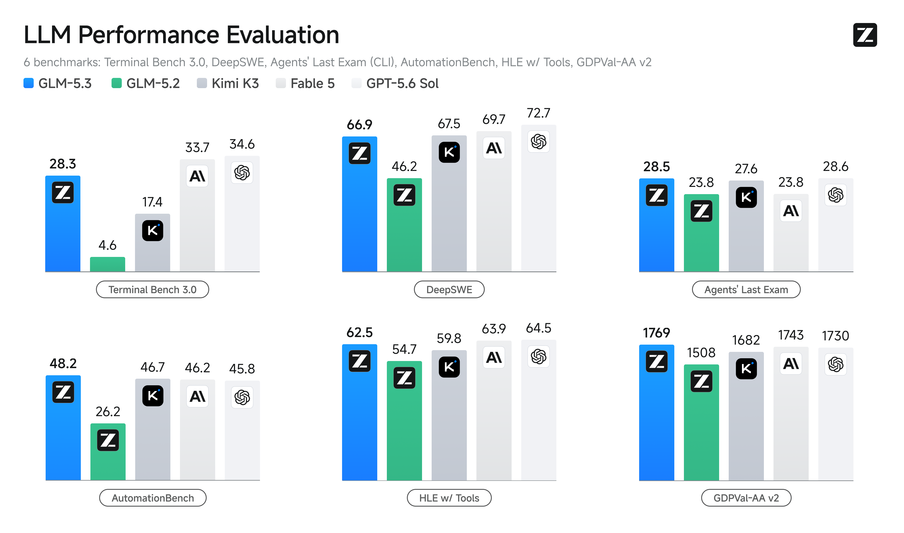

# GLM-5.3 Launches: Open Models Are Competing on Capability per Dollar

**English** | [中文](GLM-5.3%E4%B8%8A%E7%BA%BF%E4%B8%8E%E5%BC%80%E6%BA%90%E6%A8%A1%E5%9E%8B%E6%88%90%E6%9C%AC%E7%AB%9E%E4%BA%89.md)

> Last checked: 2026-08-20. Performance results, prices, API availability, and release dates can change. Confirm production decisions against Zhipu AI's official documentation and your applicable API console.

GLM-5.3 has arrived with a message that matters far beyond one model release: frontier-level AI is increasingly being judged by **capability per dollar**, not just by the highest benchmark number.

Zhipu AI says GLM-5.3 is available through its API and is designed for complex coding, defensive cybersecurity, and long-running tasks. Its launch announcement also says the model scored 60 on the AA intelligence index, tying Kimi K3 for first among open models in that index and placing it alongside several closed-model flagships. Zhipu further states that GLM-5.3 keeps API pricing at the GLM-5.2 level and has the lowest single-task cost among the compared flagship models. Model weights are planned for release on the following Friday. [Source: Zhipu AI announcement summary](https://aihot.virxact.com/items/cmszeb2mx0b3srodpef1ub0j0).

Those are vendor-reported claims, not an independent benchmark result or a universal cost conclusion. Still, they point to an important change in how developers should evaluate models.

*Official performance-evaluation graphic from Zhipu AI's [GLM-5.3 launch post](https://z.ai/blog/glm-5.3). It compares GLM-5.3 with other models on six benchmarks; results are Zhipu AI's reported measurements.*

## The old question: Which model is the smartest?

For a long time, choosing an LLM often meant choosing the model with the strongest public reputation or benchmark result. That can be a sensible shortcut, especially for a new project.

But it is not enough for a production workflow.

The practical question is now:

> Which model completes *our* task reliably at an acceptable total cost, latency, and operational risk?

This distinction matters because a model's token price is only one part of its real cost. A lower-priced model can become expensive when it needs repeated retries, loses critical context, produces code that requires extensive review, or fails late in an agent workflow.

Conversely, a model with a higher per-token price may be the cheaper choice if it completes a task correctly in fewer steps.

## Why task cost is a better metric than token cost

Consider a typical AI coding task:

1. Read a repository and its conventions.
2. Identify the relevant files and dependencies.
3. Propose an implementation plan.
4. Make coordinated changes across the codebase.
5. Test the work, interpret failures, and fix regressions.

The cost of that work includes much more than input and output tokens:

- Retries caused by incomplete reasoning
- Repeated repository context
- Tool calls and intermediate outputs
- Engineering time spent reviewing or repairing results
- Latency that interrupts an interactive workflow

For this reason, “lowest single-task cost” is a more useful claim to investigate than “lowest price per million tokens.” It asks whether the model can finish a meaningful unit of work with less total compute and less human intervention.

The claim must be tested, of course. Public benchmarks and vendor measurements may use workloads that do not resemble your product. But the evaluation principle is sound.

*Official Z.ai Code Bench graphic from Zhipu AI's [GLM-5.3 launch post](https://z.ai/blog/glm-5.3). The chart presents the vendor's reported agentic-coding accuracy and average output-token comparison.*

## What GLM-5.3 signals for open-model users

The GLM-5.3 release is part of a broader shift. Open-weight and open-ecosystem models are no longer only fallback options for teams that need self-hosting.

They are increasingly credible candidates for demanding workloads such as:

- Repository-level coding assistance
- Long-context document analysis
- Multi-step agents
- Internal developer tools
- Security review and defensive analysis

*Official cybersecurity-evaluation graphic from Zhipu AI's [GLM-5.3 launch post](https://z.ai/blog/glm-5.3). It is included to illustrate the release's stated focus on defensive cybersecurity; scores are vendor-reported.*

That does not mean every team should immediately migrate from closed models. Mature closed-model platforms can still offer stronger tooling, reliability, integrations, and support for specific use cases.

Instead, the opportunity is to stop treating model selection as a permanent, winner-take-all decision.

## Build a model portfolio, not a model dependency

The most resilient AI products use different models for different jobs.

| Workload | What to optimize for |
| --- | --- |
| Complex code changes | Task success rate, tool use, and context retention |
| Extraction and classification | Cost, structured output, and throughput |
| User-facing chat | Latency, tone, and safety behavior |
| Long documents | Context quality, retrieval strategy, and caching |
| High-volume internal jobs | Total cost, rate limits, and availability |

This approach offers practical benefits:

- A provider outage or quota change does not stop the whole product.
- Teams can test new releases without rewriting the application.
- Lower-cost models can handle routine work while stronger models handle difficult tasks.
- Real workload data, rather than marketing claims, drives routing decisions.

## A practical way to test GLM-5.3

Before putting a new model into production, create a small evaluation set from real tasks. Do not rely only on a leaderboard.

For coding, include examples such as:

- A bug fix with tests that reveal an edge case
- A feature that requires changes in several files
- A refactor with explicit compatibility constraints
- A task requiring the model to use repository documentation correctly

Then compare models on the same inputs. Record:

1. **Task success** — Did the result pass tests or meet the acceptance criteria?
2. **Total requests** — How many retries or follow-up prompts were required?
3. **Total cost** — Include every request, not only the final answer.
4. **Latency** — Is the experience suitable for your workflow?
5. **Human correction time** — How much work was needed before the output could ship?

The best model is not necessarily the one that wins every row. It is the one that produces the best result for a defined workload and budget.

## The bigger trend: frontier access is becoming less concentrated

When capable open models become cheaper to run and easier to access through APIs, the market changes in three ways.

First, developers gain negotiating power. They can compare options rather than accept the price, quota, and availability of one provider.

Second, AI features become easier to make economically viable. A task that was too expensive at closed-model pricing may become practical with a model that reaches acceptable quality at a lower total cost.

Third, infrastructure flexibility becomes a product advantage. Teams that can compare, route, and replace models quickly can respond to model launches, price changes, and capacity issues much faster.

## Final takeaway

GLM-5.3 is worth watching not merely because it posts a strong reported score. It represents the growing pressure on every LLM provider to deliver more useful work for less money.

For developers, the response should not be blind loyalty to the newest model. It should be a better evaluation habit: measure total task cost, preserve the ability to switch providers, and select models according to the needs of each workflow.

That is where a multi-model API strategy becomes valuable. A unified gateway such as [SupaNexus](https://supanexus.ai/) can help teams reduce repeated integrations across providers and keep model selection flexible as the ecosystem evolves.

## Sources and notes

- [AI Hot: GLM-5.3 launch summary, citing Zhipu AI](https://aihot.virxact.com/items/cmszeb2mx0b3srodpef1ub0j0), accessed 2026-08-20.
- [Zhipu AI: GLM-5.3—Frontier Coding with Emergent Cyber Capabilities](https://z.ai/blog/glm-5.3), accessed 2026-08-20. The three images in `attachments/` are unmodified copies of charts published on this official page.
- The performance, pricing, task-cost, API, and open-weight release statements in this article are attributed to the launch summary and should be verified against Zhipu AI's official materials before making a purchasing or deployment decision.

## Update log

- **2026-08-20:** Initial publication; added three sourced official Zhipu AI charts; corrected the referenced multi-model gateway to SupaNexus.
