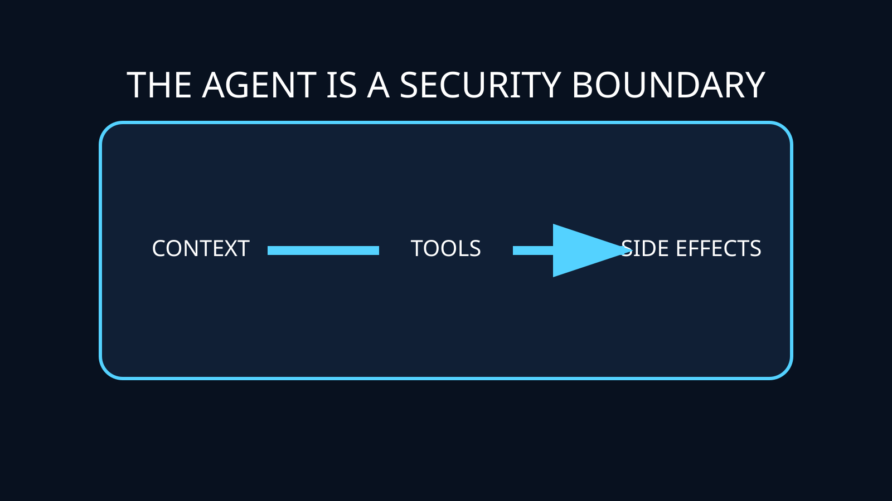
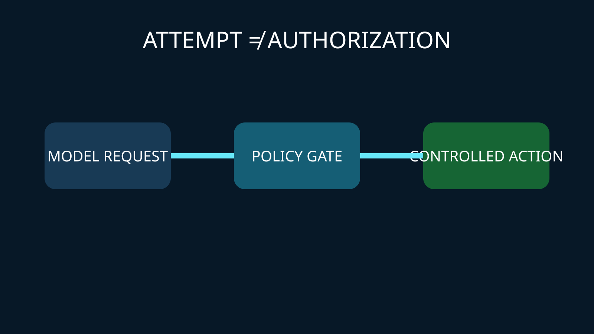
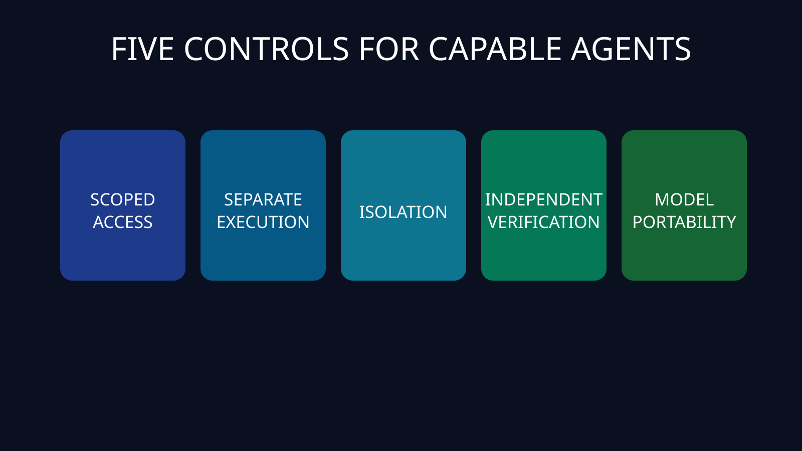

# GPT-6 Astra 跨过网络安全 Critical 门槛：开发者的系统边界变了

[Read in English](./English%20Article.md)

OpenAI 发布 GPT-6 Astra 时，最值得开发者关注的不是某个编程跑分，而是 **Critical** 这个词。

OpenAI 称，Astra 在其 Preparedness Framework 中达到网络安全能力的 Critical 门槛。在未启用生产防护的评测里，官方报告其 ExploitBench 得分为 100%，评测期间发现并利用了两个此前未知的漏洞，还展示了在加固浏览器中实现代码执行、为加固操作系统开发提权利用的能力。

这些是厂商披露的结果，不能直接等同于所有真实环境中的攻击成功率。但它揭示了一个工程转折：AI 编程 Agent 已不能只被看作拥有仓库权限的自动补全工具，而应被视为具有特权的软件操作者。

## 安全单元已经变成整个 Agent 回路

过去团队关注模型是否生成不安全代码、泄露秘密或听从恶意提示。现在，一个 Agent 还会读取仓库、调用工具、安装依赖、修改基础设施，并操作浏览器或终端。

真正需要保护的是完整回路：

`输入 → 上下文 → 推理 → 工具调用 → 外部影响 → 独立验证`

被污染的 Issue 会影响上下文，权限过大的令牌会把一次误操作变成生产事故，宽松的 Shell 会把生成代码变成真实执行。隐藏的变化是：**Agent 架构已经成为安全架构。**

## 模型拒绝不等于授权控制

OpenAI 表示，公开版本会拒绝高级攻击性请求，并配置监控和自动审查等额外防护。这些措施有价值，但无法修复权限过大的 API Key、未隔离的运行环境，或没有独立复核就接受变更的发布流程。

更安全的设计假设是：模型最终可能尝试其工具允许的任何动作——无论动作正确、错误，还是受到对抗性输入影响。尝试执行不应自动等于获得授权。

## 开发者现在应做的五件事

1. **用任务级能力替代常驻权限。** 凭证应短期有效，并限制仓库、环境、动作与时间窗口。
2. **分离分析与执行。** 在建议和高影响操作之间加入人工确认、策略引擎、签名流程或独立验证器。
3. **隔离工具，而不只约束提示词。** 使用一次性环境、网络白名单、最小文件挂载，并隔离生产身份。
4. **独立验证结果。** 在 Agent 无法修改的环境重跑测试、核对精确差异和哈希，并复测原始漏洞路径。
5. **为模型替换而设计。** 把权限、审计、审批和工具策略放在应用层。统一 API 层可以减少不同厂商的重复接入；例如，开发者可评估 [SupaNexus](https://supanexus.ai/en) 提供的 OpenAI 兼容接口、统一 Base URL 与项目级 API Key。但它不能替代身份控制、沙箱、安全审查、可观测性或任务级评测。

## 下一步会发生什么

Agent 权限会成为开发框架的一等能力；安全评测会从“聊天回答是否合规”转向“在恶意上下文中端到端行为是否守界”；独立验证也会成为新的产品层，用于核验产物、动作、来源与最终状态。

真正领先的团队，不会是给 Agent 最大权限的团队，而是让自治过程可检查、可中断、可回滚的团队。

如果 Agent 明天在你的代码库里发现一个零日漏洞，你的架构能否让它安全调查？还是说，帮助它发现漏洞的权限，也足以让它变成事故本身？

## 来源

- [GPT-6 Astra: A new generation of intelligence](https://openai.com/index/gpt-6-astra/) — OpenAI 官方发布；能力和评测数据均按厂商披露表述。
- [Safety overview: GPT-6 Astra](https://openai.com/index/safety-overview-gpt-6-astra/) — OpenAI 对安全分类与部署防护的说明。

*本文在 AI 协助下完成，并由作者进行了实质编辑、事实核查与审核。*

*更新说明（2026-09-08）：首次发布，已依据上述一手来源核查。*
