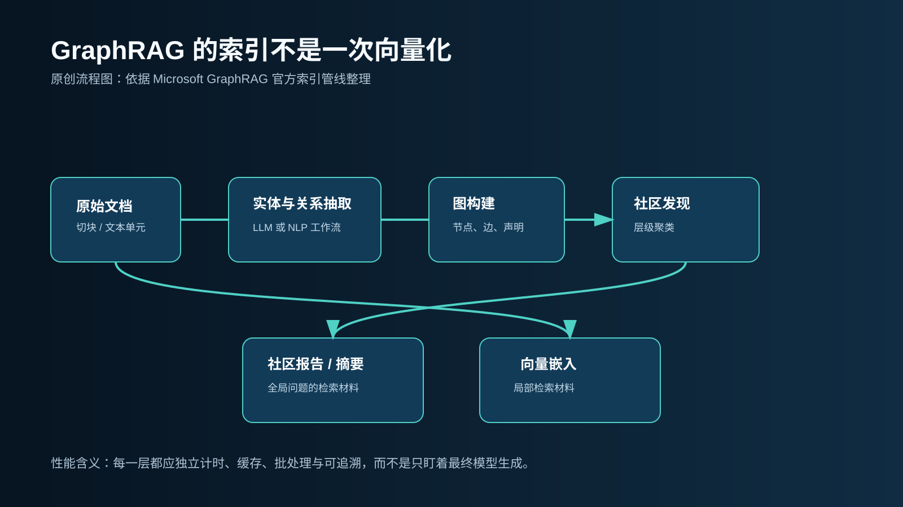
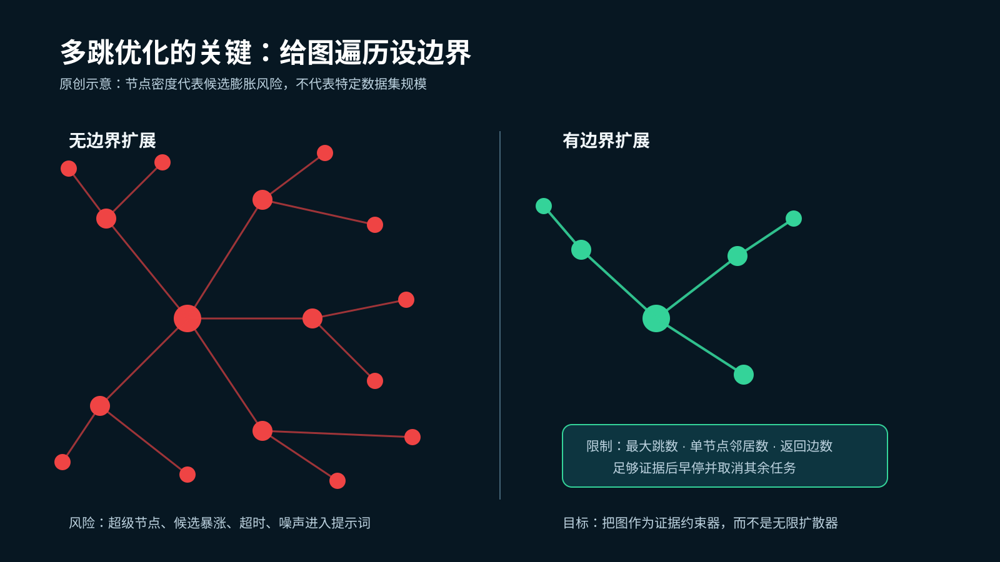
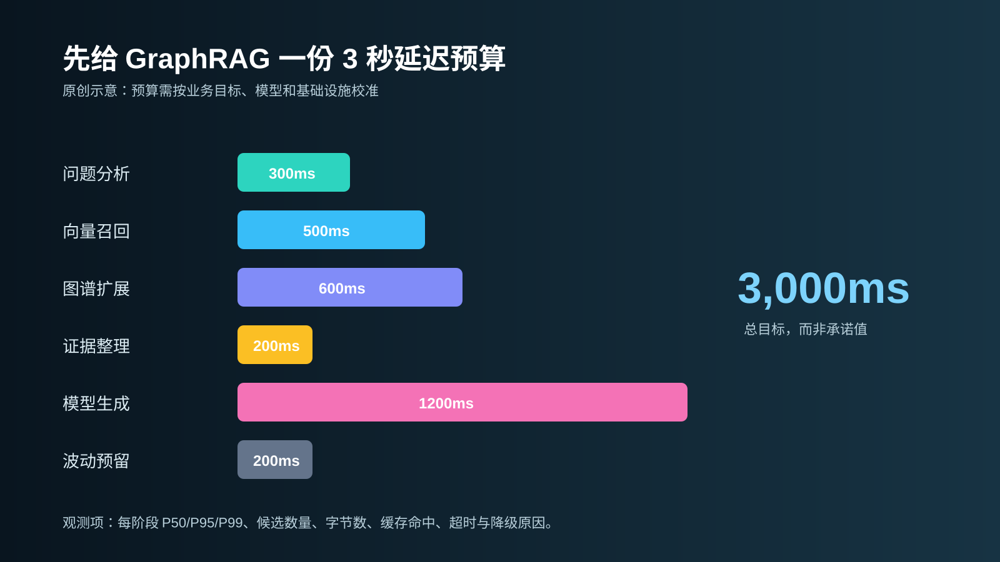
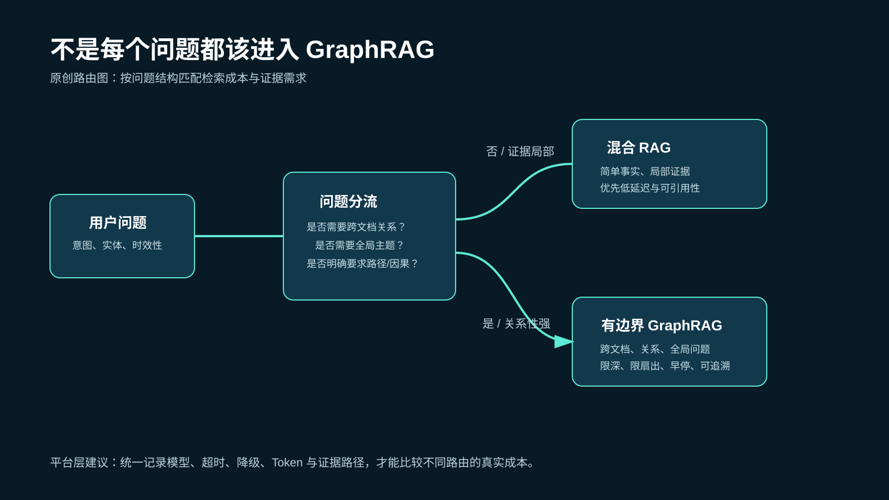

# GraphRAG in Production: Why Knowledge Graphs Can Make RAG Slower

**English** | [中文](GraphRAG实战：知识图谱和RAG结合后，为什么响应反而变慢了？.md)

> Last checked: 2026-08-24. This article distinguishes public sources, engineering guidance, and illustrative diagrams. Real latency varies substantially with corpus shape, models, graph stores, and hardware.

GraphRAG is often described as “RAG plus a graph database.” That framing hides the operational reality. Once teams deploy it, they may gain better answers for relationship-heavy questions—while watching latency move from seconds toward queues, timeouts, and unpredictable cost.

The graph is not the problem. The problem is that GraphRAG is not one additional component; it is a new production pipeline: entity and relationship extraction, graph construction, community detection, summaries, retrieval, and evidence assembly. Microsoft’s standard GraphRAG indexing flow includes these stages, and its CLI also offers a faster NLP-assisted indexing mode. Quality, cost, and speed are configuration trade-offs, not free properties of the architecture. [Microsoft GraphRAG indexing overview](https://microsoft.github.io/graphrag/index/overview/) · [CLI reference](https://microsoft.github.io/graphrag/cli/)

*Original explanatory diagram based on Microsoft GraphRAG’s public indexing flow. It shows processing stages, not fixed stage timings.*

## The short answer: generation is often not the slowest step

Classic RAG mainly spends its budget on chunking, embeddings, retrieval, and generation. GraphRAG adds three harder engineering questions:

- **Is the graph clean?** Aliases, homonyms, headings, page furniture, and table labels can all become misleading nodes or edges.
- **Is traversal bounded?** Multi-hop expansion and hub nodes can turn a few relevant items into a huge candidate set.
- **Can the system measure its trade-offs?** Without stage latency, candidate counts, and timeout reasons, teams cannot decide when graph retrieval is justified or when to fall back.

So “GraphRAG is slower than RAG” is not a diagnosis. It is a set of hypotheses to test.

## Bottleneck 1: indexing turns into thousands of tiny requests

Extraction quality is not only a model-accuracy issue. In production, three failure modes become common:

1. **Structural noise becomes graph data.** Page numbers, section headings, and table captions are extracted as if they were domain entities.
2. **Entity resolution has no closed loop.** “Bank of China,” “BOC,” and locally ambiguous names require aliases, types, provenance, and versioning—not just string matching.
3. **The request granularity is wrong.** A public RAGFlow issue describes `set_graph()` embedding entities and relations one at a time. At roughly 17,000 edges, the reported workflow became extremely slow; the issue recommends batches of 32 or 64 and cites related 10–50× benchmark gains.[RAGFlow Issue #16205](https://github.com/infiniflow/ragflow/issues/16205)

The practical lesson is simple: perform batched cache lookup, batched embedding, and then write nodes and edges. Do not split a throughput task into thousands of independent HTTP calls.

> [!IMPORTANT]
> The 10–50× figure is a report for the implementation and environment described in the RAGFlow issue. It is not a universal GraphRAG performance claim. Benchmark your own endpoint, graph shape, and concurrency.

## Bottleneck 2: multi-hop reasoning becomes unbounded search

Multi-hop retrieval is useful because it restores relationships across documents. It is dangerous because every hop can expand the candidate space.

Hub entities such as “policy,” “AI,” or a country name can connect a small seed set to a large number of weakly related neighbors. Ranking, serialization, and LLM context then all pay for that expansion—and the noise can displace the evidence that matters.

*Original diagram. Node density illustrates candidate-expansion risk; it is not a measurement from a particular company or dataset.*

Production defaults should not be “go as deep as possible.” Bound at least:

- maximum hop count;
- neighbor fan-out per node;
- the number of edges or evidence units allowed into reranking and prompts.

Vector retrieval and a one-hop graph query can start in parallel. When one route already has sufficient, high-confidence, citable evidence, stop and cancel the remaining work instead of letting it consume resources in the background.

## Bottleneck 3: candidate expansion is ultimately paid in model context

Graph retrieval does not avoid LLM cost; it changes the shape of the context. A subgraph must become text, a table, or structured prompt material. More candidates mean more tokens, more prefill work, and more noise.

The retrieval objective therefore should be *sufficient evidence*, not the largest possible subgraph. The best evidence chain is short, attributable, and strong enough to support the answer.

## Replace intuition with a latency budget

For an endpoint targeting three seconds, begin with an **illustrative** budget such as this—not as a universal SLA.

*Original diagram. The budget must be calibrated against query complexity, model throughput, caching, and infrastructure measurements.*

Record for every request:

- P50/P95/P99 latency by stage;
- candidate nodes, edges, and chunks;
- input/output bytes and tokens;
- cache hits, timeouts, and fallback reasons;
- source documents and graph paths supporting the answer.

Without this data, “GraphRAG got slower” is a user impression. With it, teams can isolate whether extraction, graph storage, reranking, prompt construction, or model serving is responsible.

## Do not send every question to GraphRAG

GraphRAG earns its cost for cross-document relationships, corpus-level themes, causality, and explicit path questions. Simple factual queries usually belong on a hybrid RAG path: it is faster, shorter-context, and easier to ground in original text.

*Original architecture recommendation. Routing should be calibrated with a team’s own evaluation set, latency target, and acceptable error modes.*

This is the real distinction between GraphRAG and ordinary RAG. It is not which system is more advanced; it is which one can provide credible evidence for the current question at the lower cost.

## Six production requirements beyond the demo

1. **Entity quality and resolution:** retain entity types, aliases, provenance, time, and version.
2. **Incremental updates:** patch affected graph regions instead of rebuilding everything for every change.
3. **Bounded traversal:** make depth, fan-out, edge count, timeout, and early stop explicit controls.
4. **Answer traceability:** every conclusion should lead back to a source document and graph path.
5. **Stratified evaluation:** evaluate simple facts, local relations, cross-document relations, and global summaries separately.
6. **Observability and fallback:** when graph retrieval times out, fall back to hybrid RAG and record why.

## Make the model layer replaceable too

GraphRAG commonly uses distinct models for extraction, embedding, reranking, and generation. Reserving high-accuracy models for valuable extraction or complex generation, while using faster and cheaper models for routine steps, is usually easier to control than using one model across the whole pipeline.

When a team integrates several providers, a unified API layer can centralize call traces, timeouts, fallbacks, token usage, and cost. A multi-model gateway such as [SupaNexus](https://supanexus.ai/) can serve as that integration and routing layer. It does not replace GraphRAG; it makes model choice and provider-failure handling more controllable.

## Final takeaway

GraphRAG’s value is its ability to answer, “How are these things related?” That ability is not free: teams pay for graph quality, indexing, retrieval boundaries, and observability.

The practical rollout order is to define the question classes first, establish latency and evidence budgets second, constrain graph traversal third, and only then expand GraphRAG to new workloads after its gains on complex questions are proven.

Where does your GraphRAG latency break first: indexing, graph traversal, or model context?

## Image sources and notes

- `graphrag-indexing-pipeline.svg`: Original diagram based on the [Microsoft GraphRAG indexing overview](https://microsoft.github.io/graphrag/index/overview/).
- `latency-budget.svg`: Original illustrative budget, not an external benchmark or SLA.
- `bounded-traversal.svg`: Original candidate-expansion and bounded-traversal illustration, not a measured graph topology.
- `query-routing.svg`: Original retrieval-routing recommendation; validate it with real evaluation results and business requirements.

## Update log

- **2026-08-24:** Initial publication, including Microsoft GraphRAG documentation and a public RAGFlow performance issue. Illustrative graphics and non-generalizable performance claims are clearly labeled.
