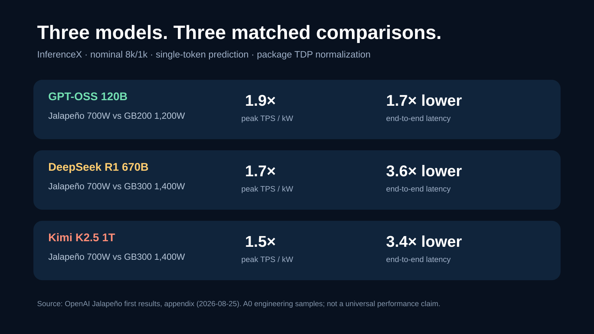
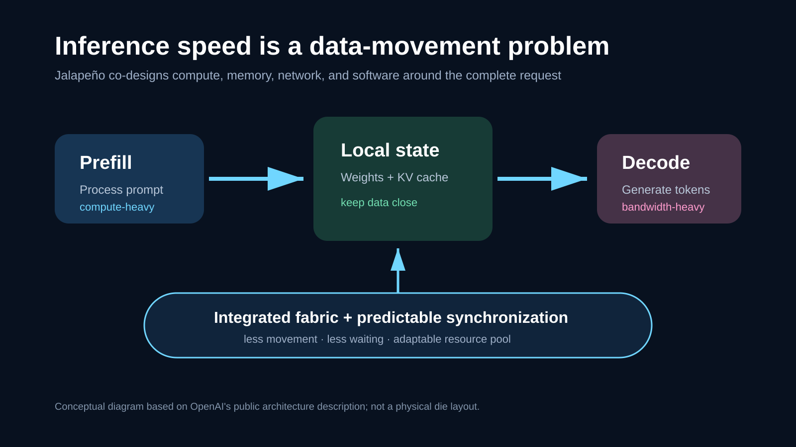
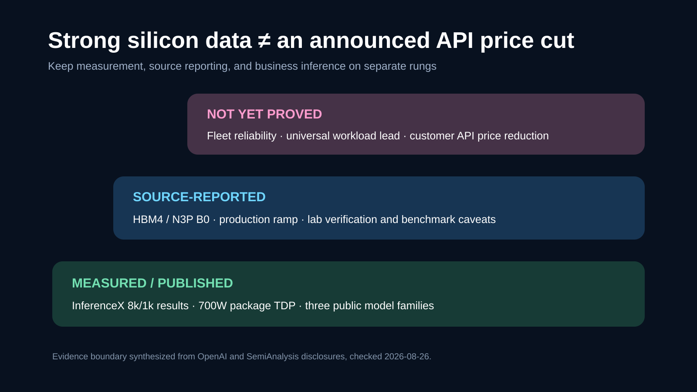
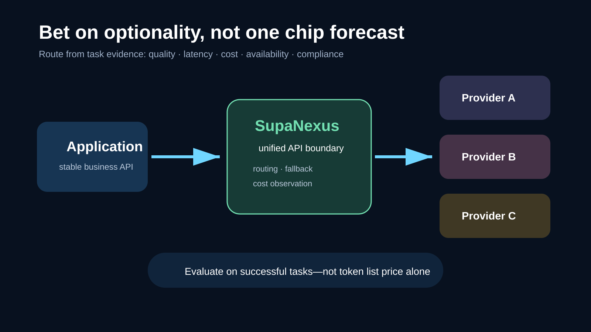

# Did OpenAI Jalapeño Beat Blackwell? The Bigger API Shift Is Not One Benchmark

[中文](README.zh-CN.md) | **English**

> Last checked: August 26, 2026. This article uses materials available that day from OpenAI, Broadcom, Nvidia, Hot Chips, and SemiAnalysis. Jalapeño remains at the engineering-sample and production-qualification stage; benchmark results are not cloud pricing, availability, or proof of performance on every production workload.

First-generation custom chips usually prove that they work before they claim the lead. OpenAI's Jalapeño has reversed that order.

In OpenAI's published InferenceX results, the LLM-inference ASIC delivered higher peak work per watt, lower end-to-end latency, and stronger interactive performance across GPT‑OSS 120B, DeepSeek R1 670B, and Kimi K2.5 1T. SemiAnalysis says it also observed and verified the runs in OpenAI's lab.

The important story, however, is larger than “OpenAI built a chip faster than Nvidia's.” **Model companies are extending competition down the stack—from models, APIs, and apps into silicon, memory, networks, kernels, and scheduling.**

*Data visualization redrawn from OpenAI's August 25 InferenceX appendix. All tests use nominal 8k/1k and single-token prediction; power efficiency is normalized with published package TDP.*

## Read the benchmark—and its boundaries

Across the three public models, OpenAI summarizes Jalapeño's results as:

- **1.5–1.9×** more peak AI work per watt;
- **1.7–3.6×** lower end-to-end latency;
- **2.1–4.1×** higher performance for highly interactive workloads.

The comparison system changes by model:

| Model | Comparison | Peak throughput / kW | End-to-end latency | Minimum TBT |
| --- | --- | ---: | ---: | ---: |
| GPT‑OSS 120B | GB200, 1,200W | ~1.9× | ~1.7× lower | ~2.7× lower |
| DeepSeek R1 670B | GB300, 1,400W | ~1.7× | ~3.6× lower | ~4.1× lower |
| Kimi K2.5 1T | GB300, 1,400W | ~1.5× | ~3.4× lower | ~3.8× lower |

Jalapeño is rated at 700W, and OpenAI says sustained measured power stayed at or below 550W in these workloads. “Half the power” is accurate only against the 1,400W GB300 rating. Against the 1,200W GB200, Jalapeño's rated TDP is about 42% lower.

Three limitations belong in the body, not a footnote:

1. These are nominal 8k-input/1k-output, single-turn workloads—not long-context, multi-turn agent traffic.
2. SemiAnalysis says OpenAI supplied the numbers. It verified the runs in person, but did not independently execute the full InferenceX suite, and no AgentX result is available yet.
3. The measured hardware is an A0 engineering sample. Production qualification, software maturity, fleet reliability, and real TCO remain to be demonstrated.

The defensible conclusion is not “Blackwell has lost.” It is: **Jalapeño's first measurable results force the market to take OpenAI's full-stack inference strategy seriously.**

## How one architecture targets throughput and latency

LLM inference is not uniform. Prefill processes the prompt and is compute-intensive. Decode emits tokens and is more constrained by memory bandwidth. Cross-chip communication, KV-cache movement, and synchronization add waiting time to the complete request.

*Original explanatory diagram based on OpenAI's descriptions of prefill, decode, local KV-cache placement, and integrated networking. It is not a physical die diagram.*

OpenAI's approach does not permanently split prefill and decode into two specialized chip pools. It uses a homogeneous resource pool, explicit data placement, a large connected domain, and predictable synchronization so compute, memory, and networking can adapt as the workload changes. The published design emphasizes reducing data movement and keeping model state, including the KV cache, local when possible.

That co-design matters even more for agents: a task may take dozens of sequential steps, so a few hundred milliseconds of extra delay per step becomes obvious user-facing latency.

## General across LLMs does not mean general-purpose

Jalapeño is not a general GPU for graphics, scientific computing, and training. It is a clean-sheet accelerator for modern LLM inference.

It is also not a fixed-function chip limited to private OpenAI models. The benchmark covered GPT‑OSS, DeepSeek R1, and Kimi K2.5. OpenAI says Codex with GPT‑Astra helped bring three open-weight models that were not on the original production plan to high performance in under two months. SemiAnalysis also reported Doom and fluid-simulation demos.

A more precise description is: **a programmable domain-specific accelerator for LLM inference**. It is narrower than a GPU while seeking flexibility across models and operating points inside that domain.

## Nine months to tapeout: what AI-assisted chip design has proved

OpenAI and Broadcom first unveiled Jalapeño in June. They say the project moved from initial design to manufacturing tapeout in nine months, with OpenAI models helping explore implementations, shorten verification loops, and optimize arithmetic circuits.

The August report adds a concrete result: on selected GPT‑OSS attention and mixture-of-experts blocks, AI-generated implementations ran **1.5–1.8× faster** than existing human-expert implementations. That number applies to selected blocks, not the full model.

*Original evidence-boundary diagram separating measured results, source-reported claims, and commercial inference. Chip efficiency should not be presented as an announced API price cut.*

Two timeline definitions also need separation. OpenAI's nine months run from initial design to tapeout. SemiAnalysis estimates roughly 16 months from early team formation to tapeout. Different starting points make the statements compatible; neither proves that ordinary multi-year chip programs can generally be compressed to nine months.

The more credible flywheel is narrower: AI searches kernel, layout, and scheduling options; hardware designed as a clear programming target gives AI a tractable search space; traces from real runs guide the next optimization. AI expands engineering search and shortens iteration—it does not remove verification, physical implementation, or manufacturing teams.

## Rubin is the fairer contemporary comparison

Blackwell demonstrates Jalapeño's current competitiveness, but it does not fully describe the market Jalapeño will enter at volume.

SemiAnalysis reports that the Jalapeño B0 compute die uses TSMC N3P and will ship with HBM4, delivering 15.4 TB/s of package memory bandwidth. Nvidia's GB200 and GB300 use HBM3E; Rubin moves to HBM4. Process, memory generation, and delivery timing therefore make Rubin the closer contemporary.

SemiAnalysis also cautions that Rubin engineering-system software is still maturing, while Jalapeño volume is expected to ramp through 2027. Today's lab curves are not tomorrow's final data-center ranking. Nvidia retains CUDA, broad workload support, mature systems, and a global supply chain. OpenAI may gain leverage from vertically coordinating its inference workloads, model roadmap, and serving software.

This is not a story about GPUs disappearing. OpenAI explicitly says it will continue deploying accelerators from Nvidia and other partners for both training and inference.

## Will an API price war follow? Possibly, not automatically

Higher work per watt can reduce energy and infrastructure pressure per inference. But there is a long chain between cheaper silicon economics and an API price cut:

- chip yield, packaging, HBM4, and networking cost;
- rack deployment, cooling, power, and operations;
- software utilization and production reliability;
- model training, R&D, and margin targets;
- whether competition forces savings to be passed to customers.

OpenAI says Jalapeño can make products more efficient and affordable; it has not announced an API price change caused by the chip. Developers should not rebuild budgets around a claimed “50% inference cost reduction.” The credible signal is directional: **model price, latency, and capacity will diverge more often.**

## Developers should preserve optionality

Most developers will never place a chip on an architecture diagram. API price, rate limits, latency, and availability are what reach the application. Instead of predicting one permanent cost leader, make model choice measurable and replaceable.

*Original reference architecture. SupaNexus is shown as one unified model-access layer; routing and fallback should be configured from a team's own quality, latency, cost, and compliance data.*

A practical workflow is to:

1. Measure quality, end-to-end latency, retries, and cost per successful task on real workloads.
2. Isolate model IDs and provider SDKs behind an adapter instead of business logic.
3. Define timeouts and fallback for rate limits, regional failures, and price changes.
4. Review provider bills together with task success rates—not just list price per million tokens.

For products using several model providers, [SupaNexus](https://supanexus.ai/) is one option for a unified API boundary. It can reduce duplicate integration work and leave a consistent place for routing, fallback, and cost observation. It does not automatically choose the best model or replace application-specific evaluation; its practical value is making a provider change less likely to require rewriting the application path.

## Four signals to watch over the next 12 months

1. **Does production deployment begin on schedule?** OpenAI plans to deploy Jalapeño inside its compute infrastructure by the end of 2026.
2. **Do long-context, multi-turn agent benchmarks appear?** They will better represent developer workloads than single-turn 8k/1k tests.
3. **Do Rubin and Jalapeño get a matched comparison?** The same model, quality, latency target, and full-system power are essential.
4. **Does efficiency reach the product?** API prices, batch discounts, speed tiers, and capacity reliability ultimately matter more to developers than peak silicon numbers.

## Conclusion

Jalapeño matters not because OpenAI crossed above Blackwell on one chart, but because a first-generation chip shows that model, compiler, kernel, silicon, rack, and product can become one continuous optimization loop.

If the platform clears production, reliability, and ecosystem hurdles, AI infrastructure competition will no longer be only about which chips Nvidia, AMD, and cloud providers sell. It will also be about which workloads frontier model companies choose to define in hardware themselves.

For developers, the safest bet is not predicting the final winner. It is building an application that can benefit from any winner.

Could your system switch to a faster, cheaper, or more reliable model service today without changing business logic?

## Sources and image notes

- [OpenAI: Jalapeño's first performance results (August 25, 2026)](https://openai.com/index/jalapeno-first-results/)
- [OpenAI: OpenAI and Broadcom unveil Jalapeño (June 24, 2026)](https://openai.com/index/openai-broadcom-jalapeno-inference-chip/)
- [Broadcom: joint announcement (June 24, 2026)](https://investors.broadcom.com/node/64506/pdf)
- [SemiAnalysis / InferenceX: Jalapeño, Blackwell, and Rubin analysis (August 25, 2026)](https://inferencex.semianalysis.com/blog/openai-jalapeno-better-than-nvidia)
- [Nvidia: official GB300 NVL72 specifications](https://www.nvidia.com/en-us/data-center/gb300-nvl72/)
- [Hot Chips 2026 official program](https://hotchips.org/)
- All four SVGs are original information graphics. The benchmark chart redraws OpenAI's published appendix; the others explain the cited material and are not official die diagrams or performance promises.

## Update log

- **2026-08-26:** Initial publication; verified the three InferenceX comparisons and added engineering-sample, single-turn 8k/1k, Rubin-generation, and API-price-transmission caveats.
