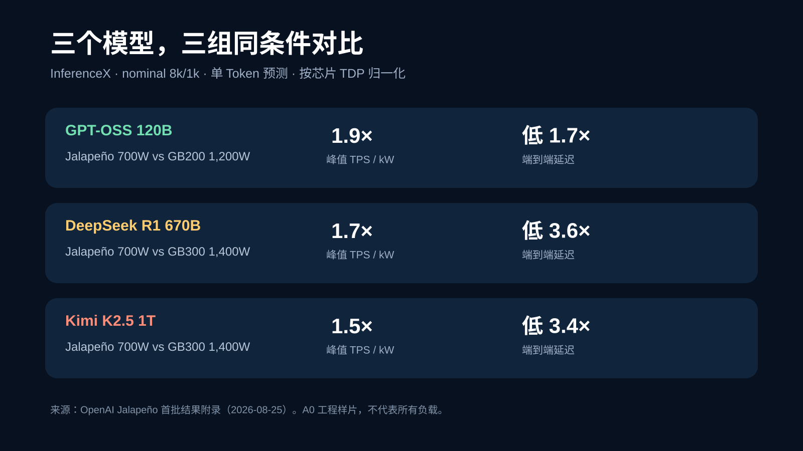
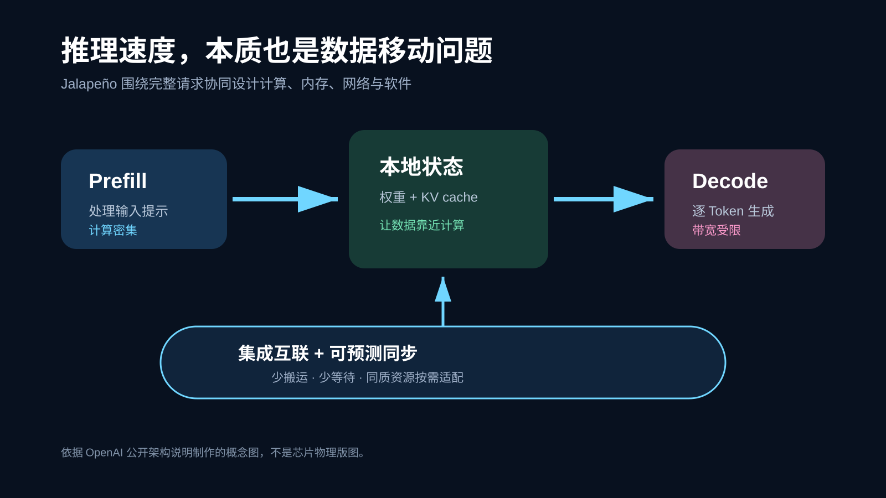
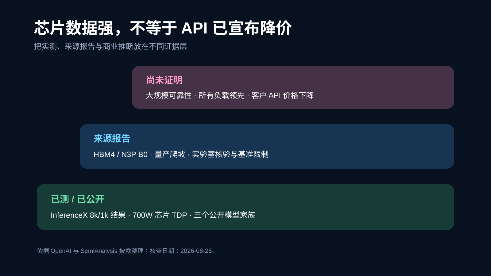
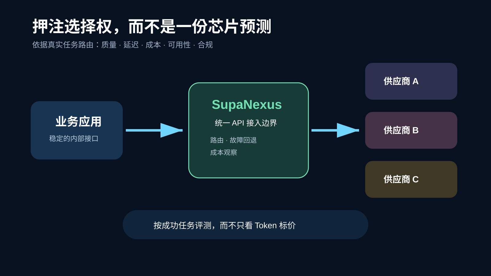

# OpenAI Jalapeño 击败 Blackwell？真正改变 API 竞争的不是一张跑分图

**中文** | [English](README.md)

> 最后核查：2026-08-26。本文依据 OpenAI、Broadcom、Nvidia、Hot Chips 与 SemiAnalysis 当日可访问材料。Jalapeño 仍处于工程样片和量产准备阶段；基准结果不等于公开云服务价格、可用性或所有生产负载的表现。

第一代自研芯片通常先证明“能跑”，再谈“领先”。OpenAI 的 Jalapeño 却把顺序倒了过来。

在 OpenAI 公布的 InferenceX 结果中，这颗面向 LLM 推理的 ASIC，在 GPT‑OSS 120B、DeepSeek R1 670B 和 Kimi K2.5 1T 上同时给出了更高的峰值每瓦吞吐、更低的端到端延迟，以及更高的交互性能。SemiAnalysis 还称，它在实验室核验了相关运行。

但真正值得开发者关注的，不是“OpenAI 做出一颗比 Nvidia 快的芯片”这么简单。更深的变化是：**模型公司正在把竞争从模型参数、API 和应用，一路向下延伸到芯片、内存、网络、内核与调度。**

*数据图。复绘自 OpenAI 2026-08-25 公布的 InferenceX 附录；均为 nominal 8k/1k、单 Token 预测（STP），功耗按芯片公开 TDP 归一化。*

## 先看跑分，也先看清跑分边界

OpenAI 汇总称，Jalapeño 在三个公开模型上实现：

- 峰值每瓦工作量为对比系统的 **1.5–1.9 倍**；
- 端到端延迟降低 **1.7–3.6 倍**；
- 高交互负载性能提高 **2.1–4.1 倍**。

拆开看，比较对象并不相同：

| 模型 | 对比系统 | 峰值吞吐 / kW | 端到端延迟 | 最低 TBT |
| --- | --- | ---: | ---: | ---: |
| GPT‑OSS 120B | GB200，1,200W | 约 1.9× | 约低 1.7× | 约低 2.7× |
| DeepSeek R1 670B | GB300，1,400W | 约 1.7× | 约低 3.6× | 约低 4.1× |
| Kimi K2.5 1T | GB300，1,400W | 约 1.5× | 约低 3.4× | 约低 3.8× |

Jalapeño 的额定 TDP 是 700W；OpenAI 称这些负载中的持续实测功耗不高于 550W。于是，“一半功耗”只适合与 1,400W 的 GB300 对比；相对 1,200W 的 GB200，额定 TDP 低约 42%，不能笼统写成一半。

还有三条不能藏在脚注里的限制：

1. 测试是 nominal 8k 输入 / 1k 输出的单轮工作负载，不代表长上下文、多轮 Agent 生产流量。
2. SemiAnalysis 表示数字由 OpenAI 提供，它在实验室核验了运行，但没有独立跑完整套 InferenceX，也尚无其更偏生产 Agent 的 AgentX 结果。
3. 当前是 A0 工程样片；量产资格、软件成熟度、大规模可靠性和真实 TCO 仍要继续验证。

所以最准确的标题不是“Blackwell 已经输了”，而是：**Jalapeño 的第一轮可测结果，已经迫使市场认真看待 OpenAI 的全栈推理路线。**

## 为什么它能同时追求吞吐与低延迟

LLM 推理不是一种均匀工作。Prefill 处理输入提示，更偏计算密集；decode 逐 Token 生成结果，更容易受内存带宽限制；跨芯片通信、KV cache 搬运与同步又会把等待时间叠加到完整请求上。

*原创解释图。依据 OpenAI 对 prefill、decode、KV cache、本地放置与集成网络的公开描述绘制，不是芯片物理版图。*

OpenAI 的设计思路不是给 prefill 和 decode 固定分配两种芯片池，而是构建同质化资源池，通过明确的数据放置、较大的互联域和可预测同步，让计算、内存与网络适应负载变化。其公开说明特别强调减少数据移动，并尽可能让模型状态与 KV cache 保持本地。

这类协同设计的价值，在 Agent 场景会被放大：一个任务可能连续执行几十步，单步多等几百毫秒，最终就会变成明显的交互迟滞。

## 它不是“GPT 特供”，但也不是普通 GPU

“通用”这个词容易造成误解。Jalapeño 不是为图形、科学计算和训练准备的通用 GPU；它是从零设计、面向现代 LLM 推理的专用加速器。

但它也不是只能运行 OpenAI 私有模型的固定功能芯片。此次测试覆盖 GPT‑OSS、DeepSeek R1 与 Kimi K2.5。OpenAI 表示，借助 Codex 和 GPT‑Astra，团队在不到两个月内把三个原本不在生产计划中的开放权重模型适配到较高性能。SemiAnalysis 还记录了 Doom、流体模拟等演示。

因此更严谨的定义是：**面向 LLM 推理领域的可编程专用芯片**。它的范围比 GPU 窄，但在这个范围内追求跨模型、跨负载形态的适应性。

## 9 个月流片：AI 造芯的证据到了哪一步

OpenAI 与 Broadcom 在 6 月首次公开 Jalapeño。官方称，从初始设计到制造流片用了 9 个月，OpenAI 模型参与了实现探索、验证循环和算术电路优化。

8 月的结果给出了一条更具体的证据：在选定的 GPT‑OSS attention 与 MoE 模块中，AI 生成实现比既有人类专家实现快 **1.5–1.8 倍**。这个数字只适用于选定模块，不是整模型加速倍数。

*原创证据分层图。用于区分已测结果、来源报告与商业推断，避免把芯片性能直接等同于 API 降价。*

同样需要区分两个时间口径：OpenAI 说的是九个月完成“初始设计到流片”；SemiAnalysis 按团队组建到流片估算约 16 个月。两者描述的起点不同，并不必然矛盾。它们共同说明开发节奏很快，却不能证明传统芯片项目普遍都能从两三年压缩到九个月。

真正的新循环可能是：AI 帮助搜索内核、布局和调度方案；更适合 AI 编程的硬件提供清晰、可预测的目标；实际运行轨迹再反馈给下一轮优化。这里，AI 更像扩大工程搜索空间与缩短迭代回路，而不是替代验证、物理实现和制造团队。

## 为什么 Rubin 才是更公平的对手

Blackwell 对比能说明 Jalapeño 当前的竞争力，却不能完整代表它量产时面对的市场。

SemiAnalysis 披露 Jalapeño B0 采用台积电 N3P、计划搭配 HBM4，内存带宽为每封装 15.4 TB/s。Nvidia GB200 和 GB300 使用 HBM3E；Rubin 则进入 HBM4 世代。因此，从制程、内存与交付时间看，Rubin 才是更接近的同期对手。

SemiAnalysis 也明确提醒：Rubin 工程系统的软件还在成熟，而 Jalapeño 的规模化产出预计逐步爬坡到 2027 年。今天的实验室曲线不是明天数据中心的最终排名。Nvidia 还有 CUDA、完整系统、供应链与广泛工作负载生态；OpenAI 的优势则可能来自对自家推理工作负载、模型路线与服务软件的纵向协同。

这不是“GPU 消失”的故事。OpenAI 官方同时表示，将继续广泛部署 Nvidia 与其他伙伴的加速器，用于训练和推理。

## API 价格战会来吗？可能，但不是自动发生

更高的每瓦吞吐可以降低单位推理的电力与基础设施压力，但“芯片便宜”到“API 立刻降价”之间还有很长的传导链：

- 芯片良率、封装、HBM4 与网络成本；
- 机架部署、散热、电力和运维；
- 软件利用率与生产可靠性；
- 模型训练、研发和商业利润目标；
- 市场竞争是否迫使厂商把节省让给客户。

OpenAI 只说 Jalapeño 有望让产品更高效、更可负担，并未宣布因这颗芯片调整 API 定价。因此，开发者现在不该根据“推理成本下降 50%”重写预算，而应把它当作一个方向性信号：**模型价格、延迟和容量会更频繁地分化。**

## 开发者真正该做的是保留选择权

芯片不会直接出现在大多数开发者的架构图里，API 的价格、速率限制、延迟和可用性才会。与其预测哪家永远最便宜，不如把模型选择变成可测量、可替换的策略。

*原创参考架构。SupaNexus 作为统一模型接入层示例；路由与回退应由团队基于自己的质量、延迟、成本和合规数据配置。*

一个务实的工作流包括：

1. 用真实任务记录质量、端到端延迟、重试次数与每次成功成本。
2. 把模型 ID 与供应商 SDK 隔离在适配层，不写死在业务逻辑里。
3. 为限流、区域故障和价格变化设置明确的超时与回退策略。
4. 按周观察供应商账单与任务成功率，而不是只比较每百万 Token 标价。

对需要接入多家模型的产品，[SupaNexus](https://supanexus.ai/) 可以作为统一 API 入口的一个选择，减少重复适配，并为路由、故障切换与成本观察留出一致边界。它不会自动判断哪个模型最好，也不能替代业务侧评测；真正的价值是让切换供应商不必重写整条应用链路。

## 接下来 12 个月，关注四个信号

1. **生产部署是否按计划开始。** OpenAI 计划在 2026 年底前开始把 Jalapeño 部署到自身计算基础设施。
2. **长上下文、多轮 Agent 基准是否公开。** 这会比单轮 8k/1k 更接近开发者真实负载。
3. **Rubin 与 Jalapeño 是否出现同条件对比。** 同模型、同质量、同延迟目标和全系统功耗才有意义。
4. **效率是否传导到产品。** API 单价、批处理折扣、速度档位和容量稳定性，最终比芯片峰值更影响开发者。

## 结语

Jalapeño 最值得重视的地方，不是 OpenAI 在一张图上超过了 Blackwell，而是第一代芯片就证明了“模型—编译器—内核—芯片—机架—产品”可以成为一条连续的优化链。

如果这条路线能跨过量产、可靠性与软件生态三道门槛，AI 基础设施的竞争将不再只是 Nvidia、AMD 和云厂商卖什么芯片，也会变成大型模型公司选择为哪些工作负载自己定义硬件。

对开发者来说，最稳妥的下注不是猜中最终赢家，而是让自己的应用可以利用任何赢家。

你的系统今天能否在不改业务代码的前提下，切换到更快、更便宜或更稳定的模型服务？

## 主要来源与图片说明

- [OpenAI：Jalapeño 首批性能结果（2026-08-25）](https://openai.com/index/jalapeno-first-results/)
- [OpenAI：与 Broadcom 发布 Jalapeño（2026-06-24）](https://openai.com/index/openai-broadcom-jalapeno-inference-chip/)
- [Broadcom：联合发布公告（2026-06-24）](https://investors.broadcom.com/node/64506/pdf)
- [SemiAnalysis / InferenceX：Jalapeño、Blackwell 与 Rubin 分析（2026-08-25）](https://inferencex.semianalysis.com/blog/openai-jalapeno-better-than-nvidia)
- [Nvidia：GB300 NVL72 官方规格](https://www.nvidia.com/en-us/data-center/gb300-nvl72/)
- [Hot Chips 2026 官方日程](https://hotchips.org/)
- 本文四张 SVG 均为原创信息图；数值图复绘 OpenAI 公开附录，其余为依据上述资料制作的解释图，不是官方芯片版图或产品性能承诺。

## 更新记录

- **2026-08-26**：首发；核验三组 InferenceX 数字，补充工程样片、8k/1k 单轮测试、Rubin 世代与 API 价格传导边界。
