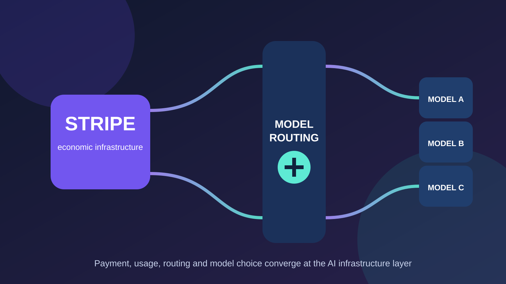
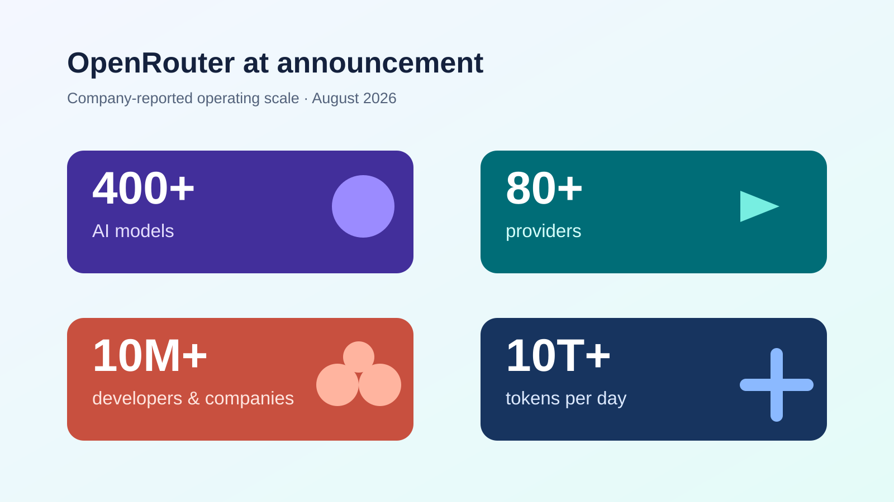
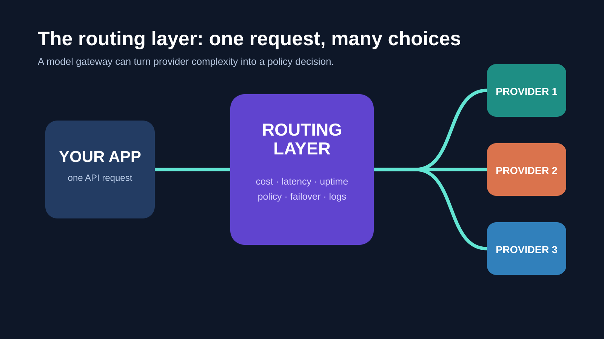
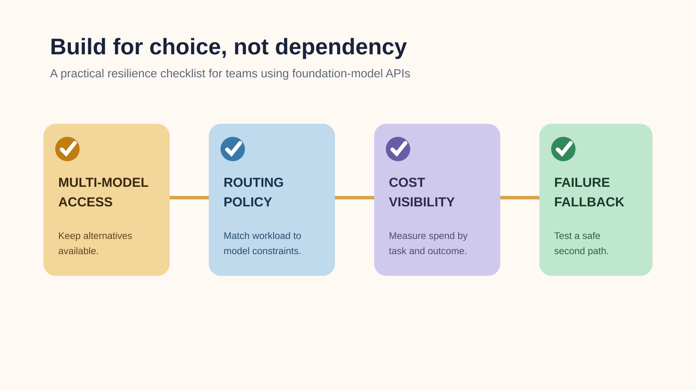

# Stripe 收购 OpenRouter：AI 路由层为什么突然成了必争之地

**中文** | [English](Stripe%20Acquires%20OpenRouter%20and%20the%20AI%20Routing%20Layer.md)

> 最后核查：2026-08-21。Stripe 已于 2026 年 8 月 19 日宣布已同意收购 OpenRouter；双方**没有公开交易金额**。本文会把官方确认信息与媒体报道严格区分。

Stripe 买的不是又一家模型实验室，而是一层连接模型、应用、用量与结算的基础设施。

8 月 19 日，Stripe 宣布已同意收购 AI 模型网关与路由平台 OpenRouter。官方没有披露价格；彭博社报道称交易超过 70 亿美元，《纽约时报》报道称约 75 亿美元，Axios 报道则称超过 80 亿美元、以股票为主。无论最终数字为何，这都把一个信号放大到无法忽视：**当模型越来越多、价格与能力持续变化时，“如何选择和使用模型”本身正在成为高价值的基础设施。**

*原创示意图：根据 Stripe 与 OpenRouter 的公开公告制作，用于说明支付、用量与模型路由的连接关系，不代表双方未来的产品架构。*

## 先说结论

这不是“Stripe 也想做大模型”的故事。更准确地说，Stripe 正在把原本擅长的复杂交易优化能力，延伸到 AI 的另一种计量单位——Token。

对于开发者，这笔交易至少说明三件事：

- 多模型接入不再只是早期开发者的便利工具，而是生产系统的基础能力；
- 路由的价值不只在“换模型”，还包括成本、延迟、稳定性、合规和用量治理；
- 平台更集中时，仍应保留可替代的模型与供应商路径。

## 已确认的是什么，仍属报道的又是什么

| 事项 | 状态 | 依据 |
| --- | --- | --- |
| Stripe 已同意收购 OpenRouter | 官方确认 | Stripe 新闻稿，2026-08-19 |
| OpenRouter 在交易完成后继续独立运营、产品与当前承诺不变 | 官方承诺 | OpenRouter 公告，2026-08-19 |
| OpenRouter 覆盖 400+ 模型、80+ 提供商 | 官方确认 | Stripe 新闻稿 |
| 交易将在数周内完成 | 官方表述 | Stripe 新闻稿 |
| 交易价格 | 未公开；媒体口径不一 | Bloomberg：70 亿美元以上；NYT：约 75 亿美元；Axios：80 亿美元以上 |

这一区分很重要。文章经常把“媒体估价”写成“官方收购价”，但目前后者并未公开。也因此，下面的分析关注交易所验证的战略含义，而非把尚未确认的分配、估值或交易结构当作事实。

## OpenRouter 到底提供了什么

OpenRouter 的核心不是训练模型，而是把不同模型和提供商封装进一个统一接口，并在请求层做选择与治理。企业不必为每个模型分别维护接入、密钥、监控与故障处理；它们可以把“用哪个模型、哪个提供商、在什么约束下使用”变成一个可配置的策略。

*原创数据图：数值来自 OpenRouter 2026 年 8 月 19 日公告；“1000 万+”指开发者和企业社区，“10 万亿+”指每日处理 Token。*

这层能力覆盖的通常不只是模型目录：

- **统一接口**：将应用与多家模型服务的不同接口隔开；
- **路由与容灾**：按价格、延迟、可用性或策略选择提供商，并在某一路径异常时切换；
- **可观测性与成本控制**：按模型、团队、项目或任务查看用量，并设预算、限制和保留策略；
- **企业治理**：让允许使用的模型、数据处理要求与团队权限可以被统一执行。

OpenRouter 在今年 5 月宣布 1.13 亿美元 B 轮融资时曾披露：其周处理量在此前六个月从 5 万亿增长到 25 万亿 Token，并服务 800 万+ 开发者、接入 400+ 模型。这些数据无法直接等同于收入或利润，却足以说明路由层已经累积了实际生产流量与运行数据。

## 为什么 Stripe 会看中“路由”

从产品结构看，这笔交易并不突兀。Stripe 一直在支付侧处理多变量优化：支付方式、授权率、欺诈风险、计费与税务。模型调用同样充满变量：模型能力、单位成本、上下文长度、地区、吞吐、供应商可用性与数据要求。

*原创示意图：概括模型网关的常见工作方式；实际路由规则及性能取决于具体平台与配置。*

Stripe 在公告中称，收购后将帮助企业“智能路由请求并高效使用 Token”，以提升盈利能力。这个表述把重点放在了经营问题上：如果 AI 是产品成本，企业就需要像管理云支出和支付成本那样管理推理支出。

因此，OpenRouter 对 Stripe 的潜在价值可拆成三层：

1. **选择层**：模型不再是唯一供应商、唯一价格和唯一能力。路由层把选择变成持续决策。
2. **计量层**：Token 是可计费、可分摊、可优化的用量。谁能将模型调用与用量数据可靠关联，谁就更接近真实成本。
3. **结算层**：模型调用、账单、税务与支付原本就相邻。Stripe 与 OpenRouter 在 2026 年 1 月已经有支付、计费和税务层面的合作，这次交易是这一关系的加深，而非从零开始。

## 模型越多，路由层为何越重要

单模型时代的应用架构很简单：选一个供应商，接一个 API。但进入多模型时代后，团队常会同时面对几类取舍：

| 工作负载 | 常见优先级 | 路由应回答的问题 |
| --- | --- | --- |
| 高风险的复杂推理 | 质量、可靠性 | 哪个模型满足结果标准？ |
| 高频客服或摘要 | 单价、延迟 | 在质量达标前提下，哪个路径更省、更快？ |
| 代码 Agent | 工具调用、长上下文 | 哪个模型和提供商组合更稳定？ |
| 出现故障或限流 | 可用性 | 怎样自动或人工切换，且不改变应用接口？ |

“统一 API”只是起点；更难的部分是让这些选择可衡量、可复现、可审计。也正因为如此，路由层既可能成为开发效率工具，也可能成为企业的预算与治理控制面。

## 对开发者而言：便利增加，也要关注集中度

OpenRouter 表示交易后将保持独立运营，且产品、使命和当前承诺不变。这是正面信号；但收购尚未完成，任何长期影响仍要以实际产品、价格、数据政策和迁移成本为准。

更务实的做法不是预测某个平台一定会变贵或变差，而是把可替代性设计进系统：

*原创清单图：给使用模型 API 的团队的通用工程建议，不是对任何一家服务的承诺或评价。*

- 将业务提示词与供应商专属 SDK 解耦；
- 为关键任务设定质量、成本与延迟的验收指标；
- 保留至少一个经过测试的备用模型或备用提供商；
- 按任务和结果观察成本，而不是只比较每百万 Token 标价；
- 对数据保留、地域、KYC 和支付方式变化保持关注。

## 一个更实际的接入思路：把“模型选择权”留在自己手里

多模型策略并不意味着每个团队都要自建一个复杂的路由系统。关键是接口、观察和切换能力不应被某一家模型的价格或容量变化锁死。

[SupaNexus](https://supanexus.ai/zh) 提供多模型 API 的统一接入入口，适合希望在项目中集中管理模型调用、按任务调整模型选择的团队。对于有成本控制、可用性冗余或多模型实验需求的场景，这类统一入口能减少重复集成工作；不过，接入前仍应根据自己的数据合规、模型能力、价格和服务条款完成验证。

## 小结

Stripe 已确认的是“同意收购”，不是某个已公开的精确价格。交易是否会按预期完成、OpenRouter 的独立性会如何体现，都仍需持续观察。

但它已清楚表明一个趋势：AI 的价值不只存在于训练模型的一端，也在模型选择、请求路由、用量计量、成本控制和结算的连接层。当 Token 逐渐成为企业的可管理成本时，路由层正在从开发者工具走向 AI 经济基础设施。

## 来源与图片说明

- Stripe：[Stripe agrees to acquire OpenRouter to help businesses optimize token routing and usage](https://stripe.com/newsroom/news/stripe-agrees-to-acquire-openrouter)，2026-08-19。
- OpenRouter：[OpenRouter is Joining Stripe](https://openrouter.ai/blog/announcements/openrouter-is-joining-stripe/)，2026-08-19。
- OpenRouter：[OpenRouter Raises $113M Series B](https://openrouter.ai/blog/announcements/series-b/)，2026-05-28。
- Stripe：[Stripe powers OpenRouter’s global AI model access for millions of developers](https://stripe.com/newsroom/news/openrouter-and-stripe)，2026-01-29。
- 媒体价格报道：[Bloomberg/Fortune](https://fortune.com/2026/08/16/stripe-7-billion-deal-ai-firm-openrouter-acquisition/)、[The Information](https://www.theinformation.com/briefings/stripe-confirms-acquiring-ai-marketplace-startup-openrouter)、[Axios](https://www.axios.com/2026/08/17/stripe-openrouter-paypal)。
- 文中四张 SVG 均为 llm-cat 原创信息图，基于上述公开资料制作。

## 更新记录

- **2026-08-21**：首次发布；明确区分官方确认与未披露的媒体交易金额。
