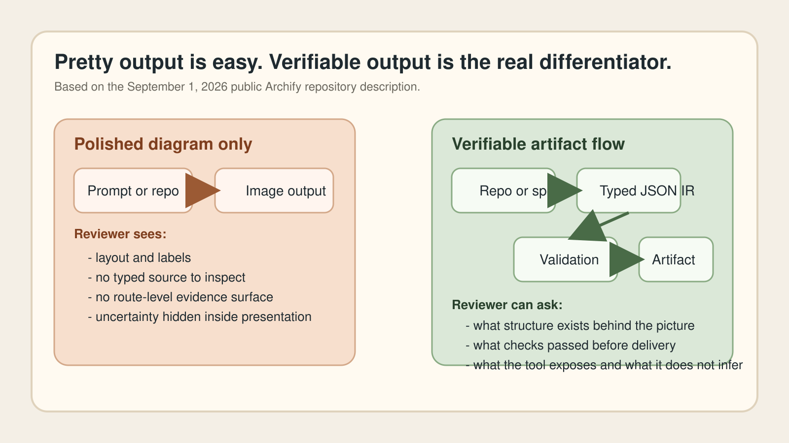
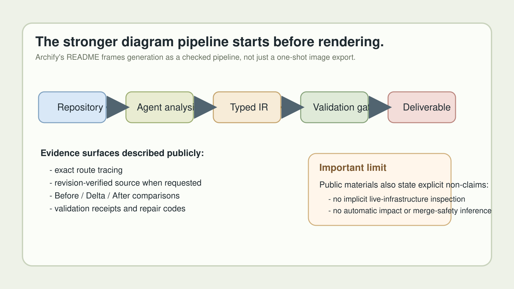
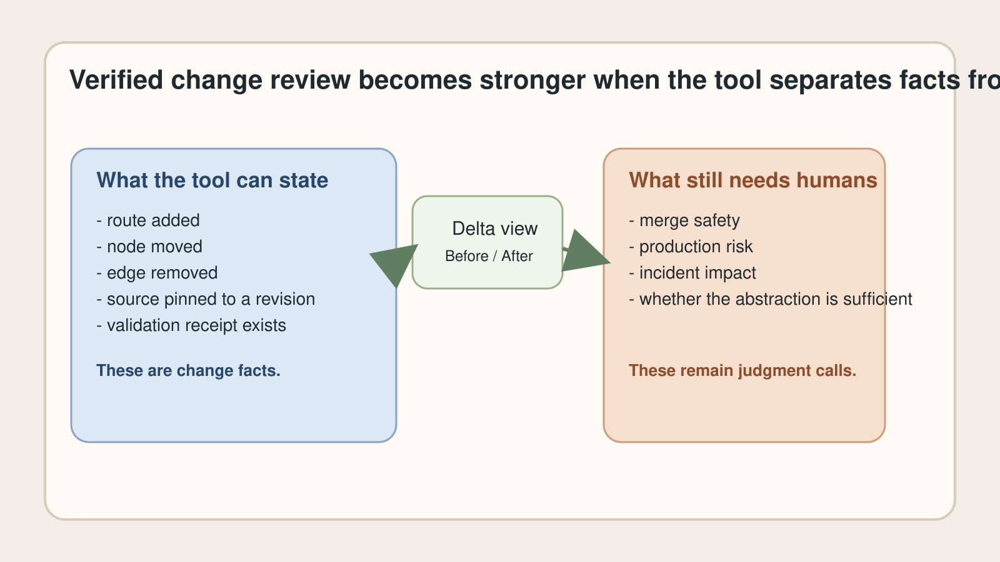

# Why Agent-Generated Architecture Diagrams Must Be Verifiable, Not Just Beautiful

[中文](%E4%B8%AD%E6%96%87%E6%96%87%E7%AB%A0.md) | **English**

> Last checked: 2026-09-01. The Archify repository, version labels, and GitHub activity are time-sensitive. This article uses the public repository README as the primary source and keeps claims bounded to what that source describes.

The new wave of agent tools has made it much easier to generate architecture diagrams from a codebase or even from a plain-language system description. That changes the baseline for visual polish.

It also changes the standard for trust.

Once a diagram is generated by an agent, the real question is no longer "does this look clean?" The stronger question is "what makes this artifact reviewable, checkable, and safe to reuse in engineering decisions?"

That is why the most important part of Archify is not that it can make beautiful diagrams. It is that the project keeps pushing the diagram toward a verifiable artifact.

## The shift is from diagram output to diagram evidence

According to the public Archify repository, the system turns a codebase or system description into an interactive system map directly in chat. More importantly, it says the agent first produces typed JSON IR and Archify then deterministically compiles that source into HTML and SVG.

That detail matters.

Most AI diagram discussions stop at appearance. A prompt goes in, a diagram comes out, and the user decides whether it looks plausible. That is useful for brainstorming, but it is a weak foundation for architecture review.

If a team is going to circulate an artifact in design reviews, PR discussions, incident analysis, or internal documentation, they need stronger properties:

- a structured source representation;
- validation before delivery;
- a way to trace what the diagram is actually asserting; and
- honest limits on what the artifact does not prove.

*Original diagram. It contrasts a screenshot-like diagram workflow with a source-backed, checkable artifact workflow.*

## Typed source is a bigger product signal than visual style

Archify's README repeatedly points back to typed JSON IR. That is a stronger signal than "diagram generation" alone because typed source changes the review model.

A typed representation means the diagram is not just pixels. It is an authored structure that validators can inspect and that a team can refine deliberately. The README also describes atomic validation before delivery, with schema, layout, HTML/SVG, route, and clearance checks required before a showcase artifact replaces the last known good output.

That is the kind of detail that separates a design gimmick from a toolchain component.

It is also why "verifiable" should not be confused with "perfectly true." A typed source does not guarantee that the author or the agent interpreted the repository correctly. It does make the artifact easier to inspect, easier to correct, and harder to treat as unexplained magic.

## Grounded interaction matters more than one-shot generation

The repository describes interactions that stay grounded: searching authored nodes, tracing exact routes, comparing semantic roles, and optionally opening revision-verified source. The public Proof Lab is also described as containing checked scenarios with JSON sources, named views, and validation receipts.

That combination is the more interesting promise.

The useful diagram is not the first screenshot. The useful diagram is the artifact that still lets a reviewer ask:

- Which route is this showing?
- Which parts are authored structure versus presentation?
- What source evidence is this pinned to?
- What changed between the previous architecture and this one?

These are review questions, not aesthetic questions.

## Change review is where verifiable diagrams become operational

One of the clearest signals in the Archify README is the emphasis on comparing validated snapshots as Before / Delta / After, with exact added, removed, changed, moved, and rerouted facts.

That moves the diagram out of the "nice explainer image" category and into a more operational role.

Engineering teams rarely need a diagram only once. They need to explain what changed, why a path moved, what new boundary appeared, and which route now matters. A diagram system that can frame change review as a checked comparison is much closer to how real teams work.

*Original diagram. It maps the repository-to-artifact pipeline described in Archify's public materials: source, typed IR, validation, checked output, and review surface.*

There is another reason this matters: the project is explicit about non-claims. The README says the optional deployment-ownership profile fails closed when required authored fields are missing, but it also says that profile is never implicit and does not inspect live infrastructure. Likewise, the Architecture Delta mode is described as not inferring impact, risk, or merge safety.

That restraint is part of what makes the product signal credible. Honest tools tell you what remains outside scope.

## What "verifiable" should mean in the agent era

In this category, verifiable does not need to mean formal proof. A more practical standard is enough:

1. The source representation is structured and reviewable.
2. The renderer runs deterministic checks before replacing the artifact.
3. A reviewer can inspect routes, views, and pinned evidence instead of only reading a summary.
4. The tool records what it can and cannot claim.
5. The artifact is portable enough to circulate without losing context.

Archify appears to be moving in that direction. The README describes one-file deliverables, exported PNG/SVG/WebM assets, machine-readable repair receipts, and a last-good preview loop that keeps a previously verified artifact visible when the latest candidate is invalid.

These are not decorative details. They are signs that the team understands the operational burden of AI-generated artifacts.

## The broader lesson for developer tools

Architecture diagrams are only one example. The deeper pattern is broader:

- agent output becomes more valuable when it carries machine-checkable structure;
- review artifacts become more useful when they preserve provenance; and
- trust improves when a tool exposes both validations and boundaries.

That is why the "beautiful" part of the Archify pitch is not the main point. Beauty gets attention. Verifiability is what makes the artifact durable.

*Original diagram. It shows how a checked change view is more trustworthy when the tool separates what changed from what it refuses to infer.*

## Five practical takeaways

1. Treat AI-generated diagrams as review artifacts, not just marketing visuals.
2. Prefer tools that expose typed source and deterministic validation over tools that only export an image.
3. Ask whether a reviewer can trace routes, inspect evidence, and compare revisions without re-prompting the model.
4. Value explicit non-claims; "does not infer merge safety" is stronger than vague confidence.
5. Expect the winning tools in this category to behave more like build systems than like slide generators.

## The real reason this topic matters

The developer-tool market does not lack diagram generation anymore. It lacks trustworthy diagram generation.

Archify is notable because it treats the diagram as something closer to a checked communication artifact. That does not eliminate human review. It does create a stronger surface for it.

In the agent era, that distinction matters. The diagram that looks polished is easy to make. The diagram that can survive scrutiny is the one teams will keep using.

## Sources and image notes

- [Archify repository README](https://github.com/tt-a1i/archify)
- The three images referenced above are original diagrams prepared for this run from the public repository description. They illustrate the sourced workflow and limits; they do not claim live runtime proof.
