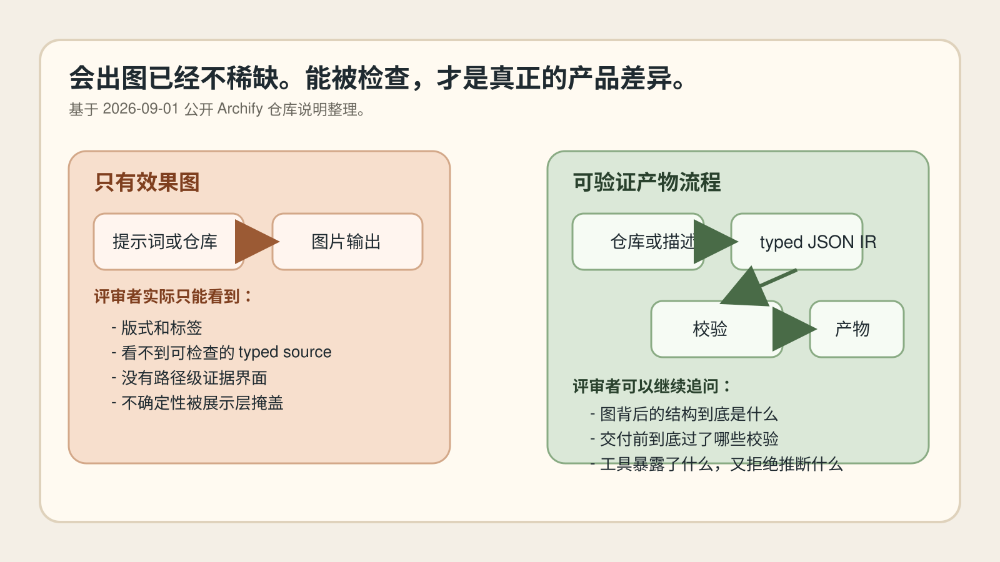
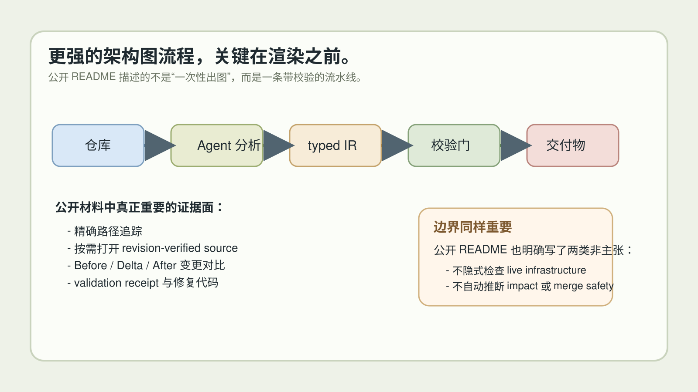
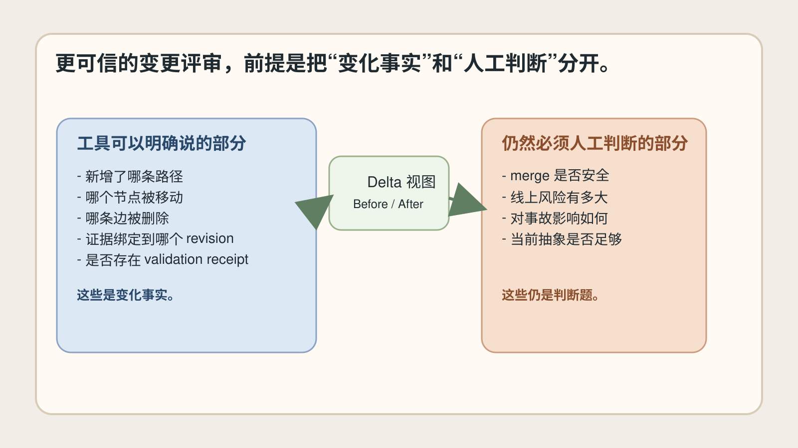

# Agent 生成的架构图为什么必须可验证，而不只是好看

**中文** | [English](English%20Article.md)

> 最后核对：2026-09-01。Archify 仓库内容、版本号和 GitHub 活跃度都可能变化。本文主要依据其公开仓库 README 撰写，只对源材料明确描述的能力和边界作出有限表述。

现在让 Agent 根据代码库或文字描述生成架构图，已经不稀奇了。真正开始拉开差距的，不是“图能不能做得更漂亮”，而是“这张图到底能不能拿来做工程沟通和评审”。

这正是 Archify 这个项目值得写的地方。

它吸引人的部分不只是视觉表现，而是它试图把架构图从演示素材，推进成一种更接近工程产物的东西。

## 关键不是出图，而是能不能被检查

Archify 的公开 README 里有一个很重要的表述：Agent 先产出 typed JSON IR，再由 Archify 以确定性的方式编译成 HTML / SVG。这个描述比“AI 自动画图”本身更重要。

因为这意味着，图背后不是只有一张截图，而是有一份结构化的中间表示。

一旦进入设计评审、PR 讨论、文档沉淀、事故复盘这些真实协作场景，团队需要的就不再只是“看起来差不多”。他们需要更强的东西：

- 结构化、可复查的源表示；
- 在交付前发生的校验；
- 能追踪图中路线和节点含义的查看方式；
- 明确写清楚“这个工具没有证明什么”。

*原创示意图。对比“只看效果图”的工作流与“有源表示、有校验、有证据边界”的工作流。*

## typed source 比视觉风格更像真正的产品信号

很多同类讨论容易停留在风格层面：配色、排版、动效、导出效果。那些当然有价值，但它们回答的是“适不适合展示”，不是“适不适合评审”。

Archify README 里更有分量的部分，是它反复强调 typed JSON IR、delivery 前的 atomic validation，以及 last-good preview 这类机制。

这几项能力组合起来，意味着它试图解决的不是“让模型随手画一张图”，而是：

1. 先把图的结构写成可检查的对象；
2. 再在输出前跑校验；
3. 失败时给出明确的修复线索；
4. 候选结果不合格时，保留上一版已验证产物。

这就更像一个工程流水线，而不是一个随机生成器。

当然，这里也不能夸大。typed source 不等于自动真实。它不能保证 Agent 一定正确理解了仓库，也不等于它已经证明了线上系统真的如此运行。但它确实把图从“不可解释的像素”往“可追问、可纠错、可复核的结构”推进了一步。

## 真正有价值的是 grounded review，而不是一次性生成

Archify README 还提到几类很值得注意的交互：搜索节点、追踪精确路径、比较语义角色、按需打开 revision-verified source。它还把公开 Proof Lab 描述为包含 JSON source、命名视图和 validation receipts 的一组已检查示例。

这意味着什么？

意味着它最有价值的时刻，不是第一次把图生成出来的那一刻，而是团队后来继续追问的时候：

- 这条链路具体是怎么走的？
- 这里展示的是作者定义的结构，还是模型自己补出来的叙述？
- 这块有没有和某个版本的源码证据绑定？
- 本次改动和上一版相比，到底新增、删减、移动了什么？

这些问题都是评审问题，不是审美问题。

## “架构变更评审” 才是更大的机会点

README 里另一个很强的信号，是它把 Before / Delta / After 的比较做成了正式能力，并强调 added、removed、changed、moved、rerouted 这些明确变化事实。

这很关键。因为大多数团队并不只需要“有一张图”，他们真正频繁遇到的是：

- 这次改动把哪条主路径改了？
- 哪个边界新增了？
- 哪个调用方向变了？
- 这是不是一次结构性变化？

如果一个架构图工具能把“变化”也做成可检查对象，它在团队里的位置就会从展示工具，往协作基础设施靠近。

*原创示意图。根据公开 README 总结出从仓库/描述，到 typed IR、校验、交付物和评审界面的链路。*

更重要的是，Archify 对自己的边界写得相对克制。README 明说可选的 deployment-ownership profile 在关键作者字段缺失时会 fail closed，但它也明确说该 profile 不是隐式启用，也不会检查 live infrastructure。Architecture Delta 也明确不推断 impact、risk 或 merge safety。

这种“不乱说自己证明了什么”的克制，本身就是可信度的一部分。

## 在 Agent 时代，“可验证”至少应该包含什么

这里的可验证，并不一定要上升到形式化证明。更务实的工程标准就已经很有价值：

1. 图背后有结构化、可审阅的源表示；
2. 输出前存在确定的校验门；
3. 评审者能追踪路径、视图和证据，而不是只读摘要；
4. 工具清楚说明自己能证明什么、不能证明什么；
5. 产物可携带、可分享，而不丢掉关键上下文。

从公开材料看，Archify 正在朝这个方向构建。README 里提到 one-file output、PNG/SVG/WebM 导出、machine-readable repair receipts，以及保存 last-good artifact 的 preview 机制，这些都不是装饰性细节，而是工程使用场景里的真实需求。

## 更深一层的启发

这篇选题真正值得写，不只是因为“架构图”本身，而是因为它折射出一条更普遍的开发者工具趋势：

- Agent 产物如果带有 machine-checkable structure，价值会更高；
- 团队协作里的说明性产物如果保留 provenance，会更耐用；
- 工具越清楚暴露 validation 和 boundary，用户越容易形成正确预期。

所以，Archify 真正重要的并不是“美观”。美观负责吸引注意力。可验证性才决定它能不能进入真实工程流程。

*原创示意图。强调“变化事实”和“工具拒绝推断的部分”需要被分开表达。*

## 五个直接结论

1. 不要再把 AI 生成架构图只当成营销视觉。
2. 优先关注是否有 typed source 和 deterministic validation，而不是只会导出图片。
3. 问清楚评审者能不能不重新提 prompt，就追踪路径、比对版本、查看证据。
4. 明确的非主张很重要，例如“不推断 merge safety”比模糊自信更可靠。
5. 这一类最终胜出的工具，更像构建系统的一环，而不是幻灯片美化器。

## 结语

现在行业里不缺“会出图”的工具，真正稀缺的是“能让图经得起追问”的工具。

Archify 值得关注，是因为它把架构图往“可检查的沟通产物”方向推进了一步。它当然不能替代人工判断，也不能直接证明线上现实。但它确实在把 Agent 生成内容从“看起来像”往“可以被复核”推。

这才是这波工具真正有机会沉淀下来的原因。

## 来源与配图说明

- [Archify 仓库 README](https://github.com/tt-a1i/archify)
- 文中三张配图均为本次 run 基于公开仓库描述原创绘制，用于解释流程与边界，不构成对线上运行状态的证明。
