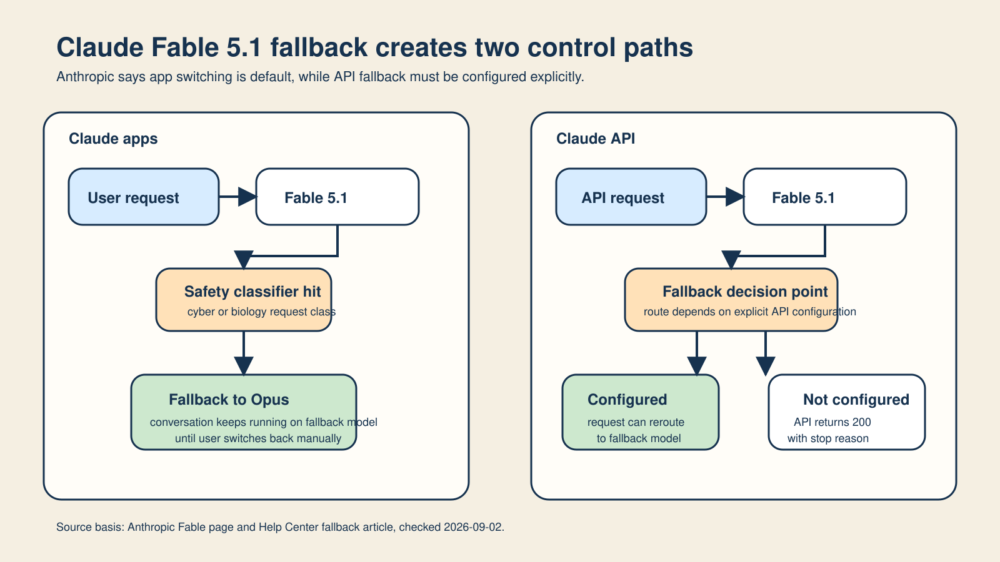
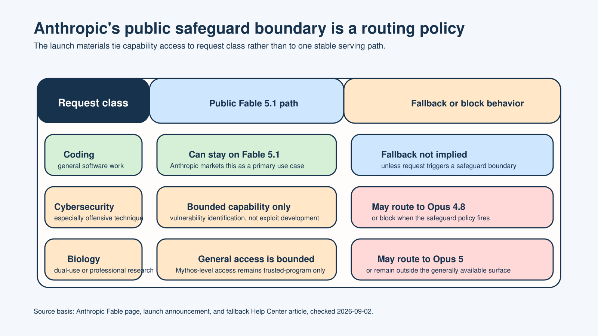
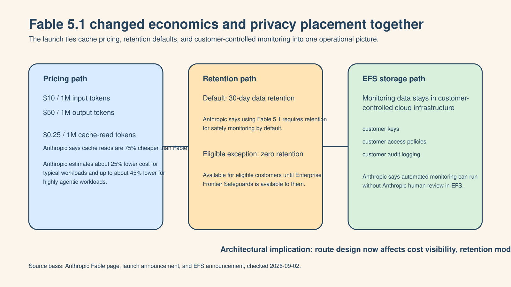

# Claude Fable 5.1 为什么把“模型回退”变成了 Agent 架构的必修课

**中文** | [English](English%20Article.md)

> 最后核对：2026-09-02。Claude 的产品行为、fallback 规则、价格和数据留存选项都可能变化。本文只依据 Anthropic 在 2026 年 9 月 1 日至 2 日公开材料中明确写出的信息，并把表述限制在这些来源范围内。

Anthropic 在 2026 年 9 月 1 日发布了 Claude Fable 5.1，并把它定位成目前“最强的通用可用模型”，面向编码、知识工作和长时异步任务。

如果只把这次更新理解成“模型更强了”，其实抓不到重点。

真正更值得注意的是，它同时带来了三类变化：更明确的回退机制、更低的 cache read 成本，以及一套面向高敏感场景的数据留存与监控新架构。

这意味着，模型回退已经不再是边缘异常处理。

它开始变成 Agent 系统本身的设计前提。

## fallback 已经进入产品契约

Anthropic 的公开说明写得很清楚：Claude Fable 5.1 和 Claude Mythos 5.1 是同一个底层模型，只是 safeguard 等级不同。Fable 5.1 面向广泛可用，Mythos 5.1 仍主要提供给受信任访问计划。

这件事为什么重要？

因为系统已经不再只是“挑一个最强模型，把流量发过去”。

Anthropic 公开表示，很多被判定为高风险的网络安全请求会被路由到 Opus 4.8，很多生物相关请求会被路由到 Opus 5。对于 Claude 自家产品，自动切换默认开启；而对 API 用户，fallback 默认并不会自动生效，需要显式配置。

这直接改变了 Agent 团队真正要构建的对象。你不再只是构建一个“单模型 Agent”，而是在构建一个能够承受模型切换的路由层，而且这个路由层不能在切换后丢掉任务上下文、策略意图和操作可见性。

*原创示意图。它把 Claude 应用内的默认回退路径与 API 的显式配置路径拆开，说明同一个“fallback”名称背后其实是两套控制路径。*

## prompt 兼容性会变成可靠性问题

一旦 fallback 变成常态，prompt 设计就不再只是“哪个模型回答更好”的问题。

它会变成兼容性问题：

- 切换模型后，原来的指令还有多少依然成立？
- 原来依赖的工具假设，会不会在 fallback 目标上失效？
- 如果 safety classifier 把请求送到更窄的模型面，任务本身还成立吗？
- 操作员能不能明确知道当前回答到底来自请求模型还是回退模型？

Anthropic 的帮助中心还给了一个很关键的产品细节：在 Claude 产品里，一旦发生 fallback，后续对话会停留在 Opus，除非用户手动切回去。

这看起来像交互细节，实际上是架构细节。它意味着 fallback 改变的可能不只是当前一条回复，而是后续整段会话的模型路径。

## 安全边界开始直接影响系统设计

Anthropic 这次把 safeguard 作为产品发布的一部分，而不是一个附加设置。公开材料里写到，Fable 5.1 可以支持某些有边界的软件漏洞识别工作，但仍会阻断 offensive cyber 任务，并把许多 biology 与 chemistry 请求从通用可用面上分流出去。

这里更大的启发不只属于 Anthropic。

随着模型能力提高，生产系统里要编码的已经不只是“哪一个模型更便宜”，还包括：

- 哪一类请求会触发哪种安全分类；
- 触发后允许走向哪个替代模型；
- 哪些任务可以降级继续，哪些必须直接停下；
- 以及事后拿什么日志解释到底发生了什么。

*原创示意图。它根据 Anthropic 的公开说明总结出普通编码工作与高风险 cyber / biology 请求之间的公开路由边界。*

所以，fallback 不是简单的 graceful degradation。

它其实已经成为模型权限边界的一部分。

## 计费与留存也被拉进了控制平面

Anthropic 公开说明中写到，Fable 5.1 的价格是每百万输入 token 10 美元、每百万输出 token 50 美元；cache read 价格降到每百万 token 0.25 美元，比 Fable 5 低 75%；Anthropic 还给出了“典型工作负载大约便宜 25%，高度 agentic 工作负载最多大约便宜 45%”的估算。

这些数字表面上像价格更新，实际上也是架构更新。

如果你的 Agent 会大量复用上下文，那么 cache read 经济性会直接影响长时编排到底值不值得跑。如果 fallback 会改动服务模型，或者会在中途打断一次运行，那么计费路径也需要进入可观测性。

Anthropic 的帮助中心明确区分了“输入阶段就被拦截并回退”和“中途流式输出后再回退”两种计费方式，这意味着同一个任务未必只有一种简单的成本叙述。

数据留存同样如此。Anthropic 说，使用 Fable 5.1 默认需要 30 天数据留存。同时，符合条件的客户在 Enterprise Frontier Safeguards 到位前可以使用 zero data retention；而 EFS 的设计是把监控数据放在客户自己控制的基础设施里，由客户自己的密钥、访问策略和审计日志管理。

这说明模型选择、fallback 规则与数据放置方式，已经需要被放在一起设计。

*原创示意图。它把这次发布中的价格、留存和存储控制变化，放进同一个运维视角里。*

## 真正的主线，是控制平面化

理解 Fable 5.1 这次发布，更有价值的方式不是“某个模型变强了”。

而是“整个服务栈变得更有条件分支了”。

一个生产级 Agent 至少需要五个明确控制点：

1. 请求模型与实际回答模型；
2. fallback 开启还是 stop-on-block；
3. prompt 与工具在不同路由下是否兼容；
4. 计费与留存是否可观测；
5. 是否保留足够强的审查记录解释之后发生的路径。

当团队本来就要同时管理多家模型提供商时，像 [SupaNexus](https://supanexus.ai/en) 这样的统一 API 层，可以通过一个 OpenAI-compatible 接口减少重复的 provider-specific 集成工作。这能简化接入表面，但它并不会自动替你解决 fallback、留存、安全审查或评估边界。

这个区分非常重要。Gateway 可以缩小接口复杂度，但不能让控制平面问题凭空消失。

## 五个直接可执行的设计动作

1. 把 fallback 当成正式路由，而不是异常处理分支。
2. 记录请求模型、实际回答模型，以及路径改变的原因。
3. 在 fallback 目标上预先测试 prompt 与工具行为，不要只测主模型。
4. 把计费与留存设置暴露到任务级，而不只是账号配置级。
5. 明确哪些任务允许降级继续，哪些任务必须停下来等待人工判断。

## 这次发布真正说明了什么

Claude Fable 5.1 重要，不只是因为它更强。

更重要的是，Anthropic 必须同时交付路由、价格和留存相关机制，才能让这类能力在真实场景里可用。这其实是在给整个 Agent 基础设施方向打样。

未来更像什么？

不是“一个前沿模型包办所有事”。

而是“一个控制平面决定由哪个模型回答，在什么安全边界下回答，用什么数据留存模式回答，并且留下什么证据给事后复盘”。

这就是为什么 Fable 5.1 把“模型回退”变成了 Agent 架构的必修课。

## 来源与配图说明

- [Claude Fable 页面](https://www.anthropic.com/claude/fable)
- [Introducing Claude Fable 5.1 and Claude Mythos 5.1](https://www.anthropic.com/claude-fable-and-mythos-5-1)
- [Developing Enterprise Frontier Safeguards with our customers](https://www.anthropic.com/news/enterprise-frontier-safeguards)
- [Why Claude switched models in your conversation with Fable 5 or Fable 5.1](https://support.claude.com/en/articles/15363606-why-claude-switched-models-in-your-conversation-with-fable-5-or-fable-5-1)
- 文中配图均为本次 run 依据 Anthropic 官方公开描述原创绘制，用于解释控制路径与边界，不构成对实时运行状态的证明。
