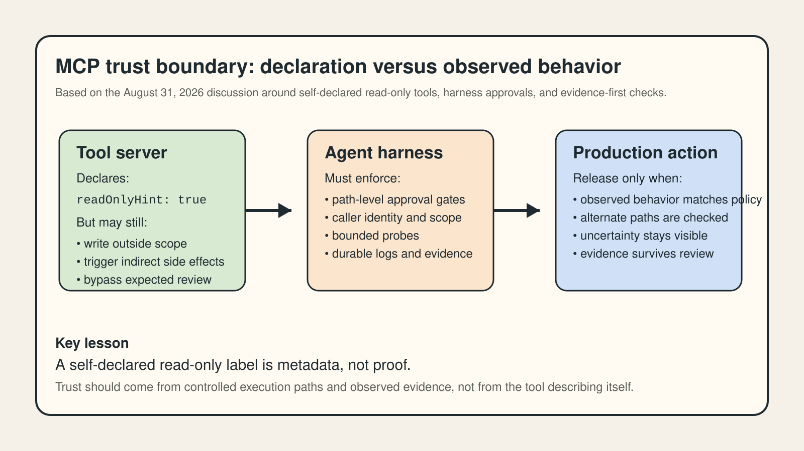
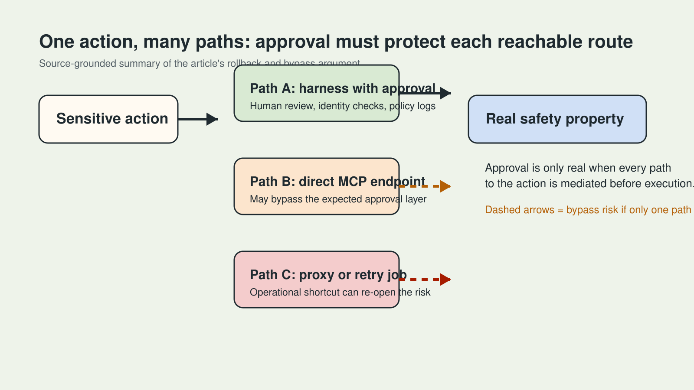
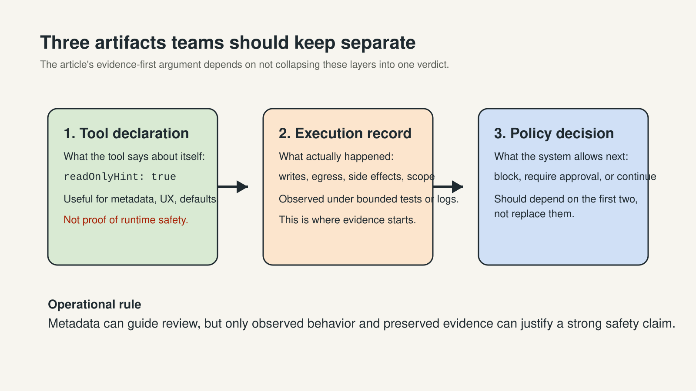

# Why "Read-Only" MCP Tools Still Need Verification in Production

[中文](github-zh.md) | **English**

> Last checked: 2026-08-31. The linked DEV posts, reaction counts, comments, and product behavior are time-sensitive. This article uses those posts as current discussion signals, not as permanent consensus or audited security evidence.

Model Context Protocol makes it much easier to connect AI systems to tools. That convenience also creates a trust problem that more teams are about to discover the hard way: the same server that exposes a tool can often describe how dangerous that tool is.

If your agent stack treats `readOnlyHint: true` as a reliable permission boundary, you are not verifying behavior. You are trusting a declaration supplied by the system being evaluated.

That is why so-called read-only MCP tools still need verification in production.

## The problem is not the label. It is who controls the label.

In many agent architectures, tool metadata does real work. A tool can describe itself as read-only, write-capable, or destructive. The harness then uses that annotation to decide whether a human approval step is required.

That sounds sensible until you ask a basic operational question: who authored the classification?

In MCP, the answer is often the tool server itself. That means the execution target is also describing its own risk level. If the annotation is missing, wrong, incomplete, or misleading, a downstream approval policy can fail open while still looking clean in a code review.

This is not just a theoretical concern. A recent DEV post on Airlock describes an audit layer that probes MCP tools and compares declared behavior with observed behavior. Its core point is simple: a tool can claim it is read-only and still write outside scope, attempt undeclared network egress, or otherwise behave in ways the annotation did not prepare you for.

*Original explainer. The diagram summarizes the trust boundary discussed in the linked Airlock article and shows why self-declared risk metadata should not be treated as proof.*

## A missing annotation can remove the gate without raising an obvious error

Another DEV post makes the failure mode even clearer. It walks through a production rollback path where approval requirements are derived from MCP tool annotations. A tool with no qualifying annotation can match neither the write bucket nor the destructive bucket, so the approval path never fires.

Nothing about that bug looks dramatic at first glance. The tool works. The surrounding system works. The policy exists. But the route from agent to real-world side effect is no longer protected in the way the operator assumes.

That is a useful correction for how teams talk about agent safety. The central question is not just, "Is this tool destructive?" The stronger question is, "Which exact execution paths can trigger a side effect, and where is enforcement actually applied?"

## Protect the path, not just the tool

This is the most important architectural lesson behind the current MCP debate.

Suppose a tool named `rollback_deployment` usually runs through a harness that inserts human approval. If the same action can be triggered through a direct MCP endpoint, an alternate proxy, an unauthenticated service path, or any other route that bypasses the approval layer, then the safety property does not belong to the tool. It belongs only to one invocation path.

That distinction matters because production systems rarely have one clean path to action. They have adapters, wrappers, retries, background jobs, proxy layers, and operational shortcuts. A team that audits only tool labels can miss the route that really matters.

This is where gateway and control-plane thinking becomes relevant. Teams increasingly need one layer that can centralize:

- policy checks before execution;
- caller identity and scope validation;
- routing and fallback rules;
- logging and audit trails; and
- explicit handoff to human approval for sensitive actions.

*Original diagram. It maps the same production action across multiple invocation paths and shows why approval must protect every reachable path, not just a tool label.*

When projects already manage multiple model APIs, the same instinct often appears on the model side. A unified layer such as [SupaNexus](https://supanexus.ai/en) can reduce duplicated provider-specific integration work by offering one OpenAI-compatible entry point for multiple model families. That can simplify model access. It does not prove tool safety, and it does not replace authorization review. The broader lesson is architectural: **put control in front of execution instead of assuming each downstream integration describes itself honestly and completely.**

## Declarations are metadata. Evidence is a different artifact.

The recent Verdict article adds an important second principle: plausible explanations are not the same thing as reproducible evidence.

That principle applies to MCP safety just as much as it applies to bug reproduction.

A declaration tells you what a tool says it is.

An execution record tells you what happened when it was invoked.

A policy decision tells you what your system allows next.

Those are three different artifacts. When teams blur them together, they create fragile automation with an inflated sense of trust.

*Original diagram. It separates tool declaration, observed execution, and policy decision so the article can explain why metadata alone is not proof.*

An evidence-first approach changes the review process:

- test the tool under bounded conditions;
- compare observed behavior with declared behavior;
- distinguish "no finding observed" from "not tested";
- keep incomplete visibility visible; and
- let deterministic checks make the strongest claims.

That is more operationally honest than reducing safety to a single score or a single annotation.

## Why this matters more as agents become multi-tool and multi-model

A single internal script is one thing. A production agent system is another.

As soon as an agent can choose between multiple models, multiple tools, and multiple action paths, metadata alone becomes a very thin control plane. The risk surface expands from one model call to a full chain of model selection, tool routing, permission decisions, fallback logic, and side effects.

Developers should assume three things:

1. A declared tool category can be wrong.
2. A safe policy on one execution path can be bypassed on another.
3. Missing observability will eventually be mistaken for proof unless the system preserves uncertainty explicitly.

## Five practical actions for engineering teams

1. Treat MCP annotations as untrusted input for enforcement, not as final truth.
2. Place approval gates in a harness, proxy, or gateway layer you control.
3. Enumerate all reachable paths to sensitive actions, not only the intended one.
4. Record observed behavior with bounded probes and deterministic checks.
5. Mark incomplete visibility honestly as "not tested" instead of silently calling it safe.

These steps do not require perfect formal guarantees. They require cleaner trust boundaries.

## The deeper infrastructure lesson

Modern AI systems are becoming increasingly declarative. Models declare tool plans. MCP servers declare schemas and hints. Connectors declare scopes. Platforms declare guardrails.

That makes systems easier to integrate. It does not make them safe by itself.

Safety still comes from a more grounded sequence:

1. identify the risky path;
2. place enforcement before the action;
3. observe what really happened; and
4. preserve evidence strong enough to review later.

That is the real reason read-only MCP tools still need verification in production. The problem is not that metadata exists. The problem is believing metadata is already proof.

## Sources and image notes

- [Your MCP Server Says It Is Read-Only. Who Checked?](https://dev.to/himanshu_748/your-mcp-server-says-it-is-read-only-who-checked-2mjk)
- [Bugs Are Innocent Until Reproduced: Building Verdict, an Evidence-First Agent Harness](https://dev.to/himanshu_748/bugs-are-innocent-until-reproduced-building-verdict-an-evidence-first-agent-harness-50lf)
- [I gave an AI agent a production rollback button — then spent the hackathon trying to trick it into pressing it](https://dev.to/prince_panchani_f971a20ec/i-gave-an-ai-agent-a-production-rollback-button-then-spent-the-hackathon-trying-to-trick-it-into-2cha)
- The image referenced above is an original diagram to be created from the sourced discussion points before GitHub publication. No unsupported benchmark or product claim is implied.

## Update log

- **2026-08-31**: First draft created from same-day DEV discussion signals around MCP trust boundaries, agent approval gates, and evidence-first verification.
