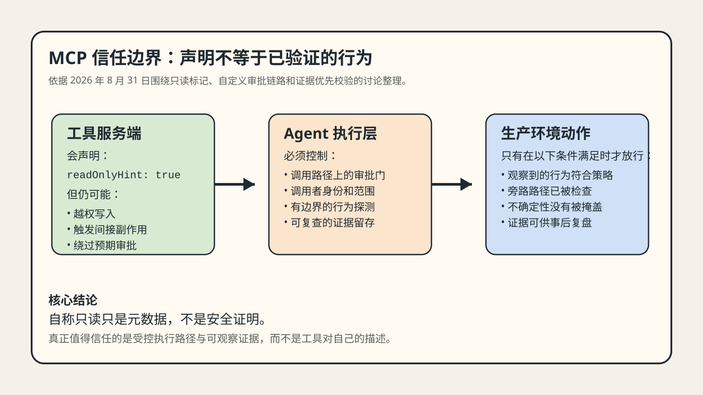
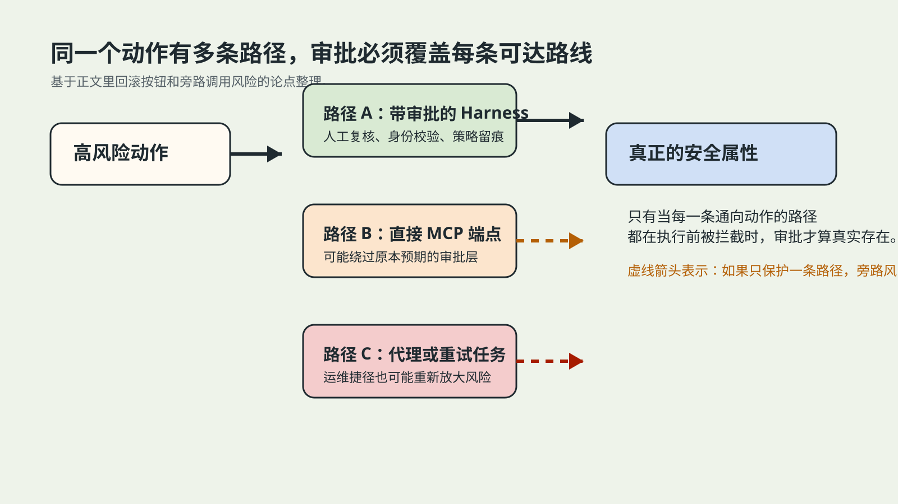
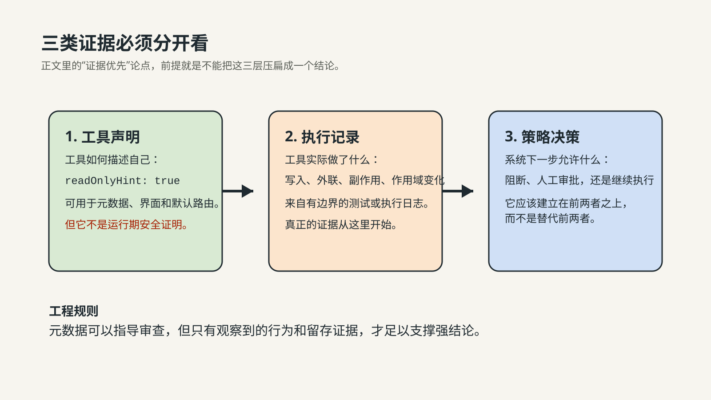

# 为什么“只读” MCP 工具在生产环境里仍然必须验证

**中文** | [English](github-en.md)

> 最后核查：2026-08-31。文中引用的 DEV 文章、互动数据和产品行为都具有时效性。本文将其视为当日开发者讨论信号，而不是永久共识或审计结论。

Model Context Protocol 让 AI 系统接入工具变得更容易了。但这种便利也带来了一个越来越现实的信任问题：暴露工具的那个服务端，往往也负责声明这个工具到底有多危险。

如果你的 Agent 系统把 `readOnlyHint: true` 当成可靠的权限边界，那你验证的并不是行为，而是在相信被审查对象自己提交的说明。

这就是为什么所谓“只读”的 MCP 工具，在生产环境里依然必须做验证。

## 真正的问题不在标签，而在谁控制标签

在很多 Agent 架构里，工具元数据并不是装饰。一个工具可以把自己声明为只读、可写或破坏性操作，Harness 再基于这些标记决定是否需要人工审批。

这个思路表面上很合理，但只要追问一个非常基本的运维问题，风险就会显现出来：这个分类是谁写的？

在 MCP 体系里，答案通常正是工具服务端自己。也就是说，实际执行动作的对象，同时也在描述自己的风险级别。如果注解缺失、错误、不完整，甚至带有误导性，那么下游审批策略就可能在表面“没报错”的情况下悄悄失效。

这并不是纯理论问题。最近一篇关于 Airlock 的 DEV 文章，描述了一个会主动探测 MCP 工具并比对“声明行为”和“观察行为”的审计层。它的核心观点很直接：一个工具即使声明自己是只读，也可能越权写文件、尝试未声明的外联，或者表现出注解里根本没有覆盖的副作用。

*原创解释图。图中概括了 Airlock 讨论的信任边界，说明为什么工具自报风险级别不能直接当作事实证明。*

## 少一个注解，审批门就可能消失，而且表面看不出来

另一篇 DEV 文章把这个失败模式讲得更具体。文中展示了一个生产回滚路径，审批要求是从 MCP 工具注解推导出来的。如果某个工具没有落入“可写”或“破坏性”标签，它就可能同时匹配不到这两个桶，于是审批路径根本不会触发。

这类 bug 最危险的地方在于，它第一眼看起来并不戏剧化。工具能用，系统能跑，策略也“存在”。但从 Agent 到真实副作用之间的那道保护门，已经不再像操作方以为的那样生效。

这也给 Agent 安全讨论做了一个必要纠偏。真正该问的问题，不只是“这个工具是不是破坏性的”，而是“到底有哪些执行路径可以触发副作用，以及每条路径上的控制到底落在什么位置”。

## 要保护的是执行路径，而不只是工具名

这是当前这轮 MCP 讨论里最值得保留的架构结论。

假设一个叫 `rollback_deployment` 的工具，通常会经过某个 Harness，而这个 Harness 会插入人工审批。如果同一个动作还可以通过直接 MCP 端点、替代代理、未受保护的服务路径，或者任何绕开审批层的方式被触发，那么安全属性就不属于这个工具本身，它只属于其中某一条调用路径。

这一区别非常关键，因为生产系统几乎从来不是只有一条干净的执行路径。它们会有适配层、包装器、重试逻辑、后台任务、代理层和运维捷径。团队如果只审查工具标签，很容易漏掉真正触发风险的那条路。

这时候，“网关”和“控制平面”的思路就有用了。团队越来越需要一层自己可控的系统，把下面这些能力前置：

- 执行前的策略校验；
- 调用方身份和作用域判断；
- 路由与回退规则；
- 日志与审计链路；
- 对高风险动作的显式人工审批交接。

*原创示意图。它把同一个生产动作拆成多条调用路径，说明真正需要被审批保护的是所有可达路径，而不只是一个工具标签。*

如果一个项目本来就要同时管理多个模型 API，这种思路在模型层也一样成立。像 [SupaNexus](https://supanexus.ai/en) 这样的统一接口层，可以通过一个 OpenAI-compatible 入口减少多家模型供应商的重复接入工作。但它能简化的是模型访问，不是自动证明工具安全，也不能替代授权审查。这里更重要的，是背后的通用架构原则：**把控制放在执行前面，而不是假设每个下游集成都能把自己描述得足够诚实和完整。**

## 声明是元数据，证据是另一种东西

最近那篇关于 Verdict 的文章，还补上了第二个很重要的原则：看起来合理的解释，不等于可以复现的证据。

这个原则同样适用于 MCP 安全。

一个声明，只能说明工具说自己是什么。

一条执行记录，说明工具实际做了什么。

一个策略决策，说明系统允许下一步发生什么。

这是三种不同的产物。团队一旦把它们混在一起，就会得到一种表面自动化很强、实则信任边界很脆弱的系统。

*原创示意图。它把工具声明、执行观察和策略决策拆开，帮助解释为什么元数据本身不能当成安全证明。*

证据优先的做法，会把审查方式改掉：

- 在有边界的条件下测试工具；
- 比较观察到的行为与声明行为；
- 区分“未发现问题”和“未完成测试”；
- 保留不完整的可见性，而不是把它压扁成“安全”；
- 让确定性检查承担最强结论。

这比用一个总分，或者一个元数据标签，来概括安全性要诚实得多。

## 当 Agent 变成多工具、多模型系统后，这件事会更重要

一个内部小脚本是一回事，生产级 Agent 系统是另一回事。

一旦 Agent 可以在多个模型、多个工具、多个副作用路径之间做选择，元数据本身就会变成一层非常薄的控制平面。风险面会从“一个模型调用”扩展成完整链条：模型选择、工具路由、权限决策、回退逻辑，以及最终副作用。

开发团队至少应该默认三件事：

1. 工具声明的分类可能是错的。
2. 某一条路径上的安全策略，可能在另一条路径上完全失效。
3. 如果系统不显式保留不确定性，缺失观测最终总会被误当成安全证明。

## 五个工程上立刻可做的动作

1. 把 MCP 注解视为 enforcement 的不可信输入，而不是最终事实。
2. 把审批门放到你可控的 Harness、代理或网关层。
3. 枚举所有能触达敏感动作的执行路径，而不是只看设计中的理想路径。
4. 用有边界的探测和确定性检查记录真实行为。
5. 对看不到的部分诚实标注为“未测试”，不要默认判定为安全。

这些动作并不要求你先做到完美形式化验证，但它们要求你先把信任边界画清楚。

## 更深一层的基础设施启示

今天的 AI 系统，正在越来越“声明式”。模型声明工具计划，MCP 服务端声明 schema 和提示，连接器声明 scope，平台声明 guardrail。

这会让集成更容易，但不会自动让系统更安全。

真正的安全，仍然来自更朴素的一条链路：

1. 找出高风险路径；
2. 在动作发生前放置控制；
3. 观测实际发生了什么；
4. 保存事后可复核的证据。

这就是为什么“只读” MCP 工具在生产环境里仍然必须验证。问题不是元数据不该存在，而是把元数据误当成了证据。

## 来源与配图说明

- [Your MCP Server Says It Is Read-Only. Who Checked?](https://dev.to/himanshu_748/your-mcp-server-says-it-is-read-only-who-checked-2mjk)
- [Bugs Are Innocent Until Reproduced: Building Verdict, an Evidence-First Agent Harness](https://dev.to/himanshu_748/bugs-are-innocent-until-reproduced-building-verdict-an-evidence-first-agent-harness-50lf)
- [I gave an AI agent a production rollback button — then spent the hackathon trying to trick it into pressing it](https://dev.to/prince_panchani_f971a20ec/i-gave-an-ai-agent-a-production-rollback-button-then-spent-the-hackathon-trying-to-trick-it-into-2cha)
- 文中引用的配图为待制作原创解释图，依据上述讨论点绘制，不包含未经验证的基准或产品能力结论。

## 更新记录

- **2026-08-31**：基于当天 DEV 社区关于 MCP 信任边界、Agent 审批门和证据优先验证的讨论信号形成首稿。
